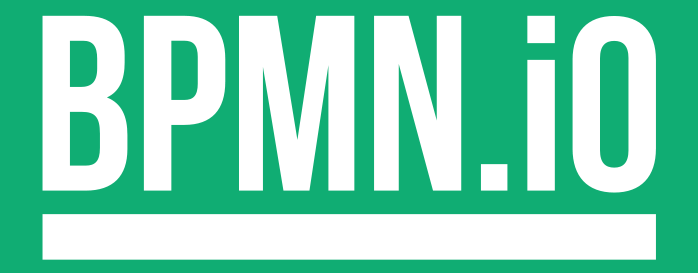
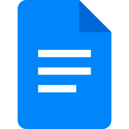

# Ferramentas

## 1. Introdução

Com o objetivo de garantir maior organização, colaboração e qualidade na
produção dos artefatos do projeto, a equipe definiu um conjunto de ferramentas
para apoiar as atividades de documentação, comunicação, modelagem e
versionamento.

A Tabela 1 apresenta as principais ferramentas utilizadas pela equipe,
juntamente com suas respectivas finalidades no desenvolvimento.

<b>Tabela 1</b> - Ferramentas Utilizadas no Projeto

| Logo | Ferramenta | Finalidade |
| :---: | :---: | :--- |
|  | BPMN.io | Criação e edição de diagramas BPMN utilizados na modelagem dos processos do projeto. |
|  | ChatGPT | Apoio à pesquisa, elaboração e revisão de conteúdos, esclarecimento de dúvidas e utilização de Inteligência Artificial Generativa nas atividades do projeto. |
|  | GitHub | Versionamento do projeto, gerenciamento do código e armazenamento dos artefatos e da documentação. |
|  | Google Docs | Elaboração colaborativa e revisão inicial de documentos e conteúdos do projeto. |
|  | Miro | Criação colaborativa de diagramas, mapas e representações visuais utilizadas durante a análise do projeto. |
|  | Microsoft Teams | Realização de reuniões e comunicação entre os integrantes da equipe. |
|  | Visual Studio Code | Criação, edição e organização dos arquivos Markdown e demais arquivos da documentação. |
|  | WhatsApp | Comunicação rápida entre os integrantes e compartilhamento de avisos e demandas. |

Autor: Arthur Fernandes (2026).

---

## 2. Referências Bibliográficas

> 1. **BPMN.IO.** BPMN Editor | bpmn-js modeler Demo. [S.l.]: bpmn.io, 2026. Disponível em: https://demo.bpmn.io/. Acesso em: 24 ago. 2026.

> 2. **CANVA.** Canva. [S.l.]: Canva, 2026. Disponível em: https://www.canva.com/. Acesso em: 24 ago. 2026.

> 4. **GITHUB.** GitHub Docs. [San Francisco, CA]: GitHub, 2026. Disponível em: https://docs.github.com/pt. Acesso em: 24 ago. 2026.

> 5. **GOOGLE.** Google Docs. [Mountain View, CA]: Google, 2026. Disponível em: https://www.google.com/intl/pt-BR/docs/about/. Acesso em: 24 ago. 2026.

> 6. **MIRO.** Miro. [San Francisco, CA]: Miro, 2026. Disponível em: https://miro.com/pt/. Acesso em: 24 ago. 2026.

> 7. **MICROSOFT.** Microsoft Teams. [Redmond, WA]: Microsoft, 2026. Disponível em: https://www.microsoft.com/pt-br/microsoft-teams/. Acesso em: 24 ago. 2026.

> 8. **MICROSOFT.** Visual Studio Code. [Redmond, WA]: Microsoft, 2026. Disponível em: https://code.visualstudio.com/. Acesso em: 24 ago. 2026.

> 9. **META.** WhatsApp. [Menlo Park, CA]: Meta, 2026. Disponível em: https://www.whatsapp.com/?lang=pt_BR. Acesso em: 24 ago. 2026.

> 10. **OPENAI.** ChatGPT. [San Francisco, CA]: OpenAI, 2026. Disponível em: https://openai.com/chatgpt/. Acesso em: 24 ago. 2026.

---

## Histórico de Versões

| Versão | Data | Descrição | Autor(es) | Revisor(es) |
| :---: | :---: | :--- | :---: | :---: |
| 1.0 | 20/08/2026 | Criação da página de Ferramentas | [Arthur Fernandes](https://github.com/arthurfernandesj)| --- |