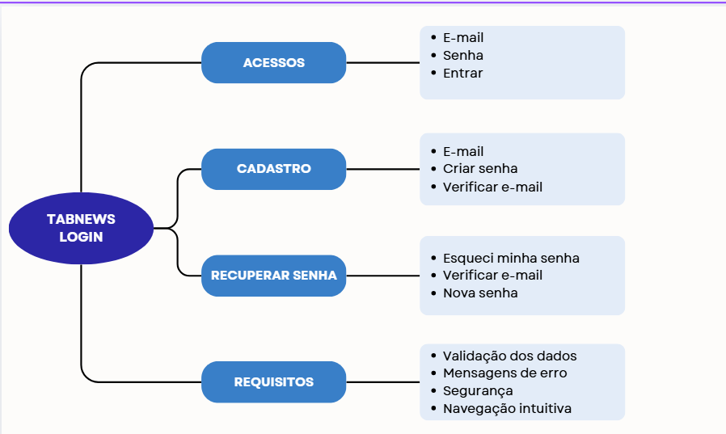
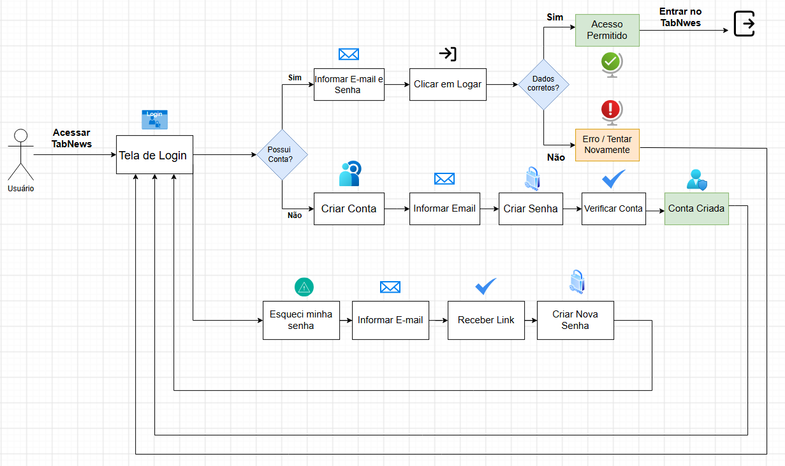

<<<<<<<<< Temporary merge branch 1
# Artefato Generalista

Nesta etapa, a equipe trabalhou na elaboração de um artefato generalista com o
objetivo de representar, de forma visual e abrangente, o contexto de um fórum
de discussão e compartilhamento de conhecimento.

O projeto utiliza o **TabNews** como principal referência para a análise de uma
plataforma de fórum, buscando compreender sua organização, seus usuários,
formas de interação, publicação de conteúdos e principais fluxos de navegação.

## Artefato escolhido — Rich Picture

Para esta entrega, a equipe optou pela utilização do **Rich Picture**, por sua
capacidade de representar visualmente diferentes elementos de um sistema,
incluindo usuários, processos, interações, problemas e relações entre os
elementos analisados.

O artefato foi desenvolvido com foco no **fluxo de Login do fórum**, permitindo
representar os principais elementos envolvidos nesse processo, desde a
interação inicial do usuário com a tela de acesso até a entrada na plataforma.

### Participantes

| Matrícula | Aluno | Participação |
| --------- | ----- | ------------ |
| 22/1022471 | Arthur Fernandes Silva de Jesus | Elaboração e revisão do Rich Picture |
| 22/1007644 | Caio Alexandre Ornelas Silva | Elaboração e revisão do Rich Picture |
| 23/1038644 | Giovana de Souza Fontes | Elaboração e revisão do Rich Picture |
| 221022060 | Leonardo Fachinello Bonetti | Elaboração e revisão do Rich Picture |

## Rich Picture

O Rich Picture apresenta o contexto do **Login do fórum**, destacando os
principais atores, elementos da interface, interações e possíveis situações
encontradas durante o processo de autenticação.

_Figura 1 – Rich Picture do fluxo de Login do fórum._

_Fonte: Integrantes da equipe (2026)._

## Justificativa da escolha

A escolha do Rich Picture ocorreu por sua capacidade de representar diferentes
aspectos de um sistema de maneira visual e de fácil compreensão.

Como o objetivo desta etapa é compreender o contexto do fórum e seus principais
elementos, o Rich Picture permite relacionar o usuário às funcionalidades e
interações presentes no processo de Login.

O recorte do Login também permite estabelecer uma relação direta com os demais
artefatos desenvolvidos pela subequipe, especialmente o **NFR Framework**, no
qual será analisado o requisito não funcional de **Usabilidade**.

Dessa forma, o artefato não busca representar detalhadamente a implementação
do sistema, mas sim fornecer uma visão geral do contexto e das interações
envolvidas no fluxo analisado.

## Relação com os demais artefatos

O Rich Picture serve como um dos insumos para os demais artefatos produzidos
pela subequipe.

| Artefato | Relação |
| -------- | ------- |
| NFR Framework | As preocupações relacionadas à interação e facilidade de uso identificadas no Rich Picture contribuem para a definição do softgoal de Usabilidade. |
| Engenharia Reversa | A análise do TabNews auxilia na identificação das características e interações presentes no fórum de referência. |
| Modelagem BPMN | Os fluxos identificados durante a análise podem ser utilizados como base para a representação dos processos em BPMN. |
| IA Generativa | Ferramentas de IA podem ser utilizadas como apoio à pesquisa, análise e elaboração dos artefatos, sempre com revisão crítica da equipe. |

## Senso crítico

O Rich Picture apresenta uma visão simplificada do fluxo de Login e, por isso,
não representa detalhes técnicos da implementação, como protocolos de
autenticação, estrutura do banco de dados ou mecanismos internos de segurança.

O recorte foi realizado dessa maneira para manter o artefato compreensível e
concentrado na interação do usuário com o processo de acesso ao fórum.

Durante a elaboração, a equipe considerou que uma representação excessivamente
detalhada poderia dificultar a compreensão do contexto. Assim, foram
priorizados os elementos diretamente relacionados à experiência do usuário
durante o Login.

## Referências

- [TabNews](https://www.tabnews.com.br/). Plataforma de conteúdo e discussões utilizada como
  referência para a análise do domínio de fóruns.

## Histórico de Versões

| Versão | Data | Descrição | Autor(es) | Revisor(es) | Detalhe da Revisão |
| :---: | :---: | :--- | :---: | :---: | :--- |
| 1.0 | 26/08/2026 | Criação da página | [Arthur Fernandes](https://github.com/arthurfernandesj) | --- | Documento criado e estruturado conforme as diretrizes da Entrega 1. |
=========
# Artefato Generalista 

# Introdução

Neste módulo, a equipe elaborou artefatos generalistas, independentes da metodologia de desenvolvimento adotada, com o objetivo de fornecer uma base para a compreensão e o desenvolvimento do projeto **TabNews**.

| **#** | **Artefato** | **Descrição** |
|---|---|---|
| 1 | [**5W2H**](https://github.com/UnBArqDsw2026-1-Turma01/2026.1-T01-_G7_MonitoreSeuTreino_Entrega_01/blob/main/docs/Base/Base/1.2.1.5W2H.md) | Delimitação do escopo, motivação, cronograma e custos do MVP |
| 2 | [**Mapa Mental**](https://github.com/UnBArqDsw2026-1-Turma01/2026.1-T01-_G7_MonitoreSeuTreino_Entrega_01/blob/main/docs/Base/Base/1.2.4.MapaMental.md) | Estruturação visual e hierárquica do escopo do projeto |
| 3 | [**Rich Pictures**](https://github.com/UnBArqDsw2026-1-Turma01/2026.1-T01-_G7_MonitoreSeuTreino_Entrega_01/blob/main/docs/Base/Base/1.2.5.RichPictures.md) | Representações visuais individuais do ecossistema do sistema |

*Tabela 8 — Artefatos generalistas produzidos neste módulo.*

### 5W2H

O [**5W2H**]() foi utilizado para organizar e delimitar o escopo do **fluxo de autenticação do TabNews**, considerando especificamente a tela de Login e suas funcionalidades relacionadas. A partir das perguntas What, Why, Where, When, Who, How e How Much, foram definidos os principais objetivos, responsabilidades, etapas e recursos envolvidos no desenvolvimento desse fluxo.

O artefato contempla o **login, criação de conta, verificação de e-mail e recuperação de senha**, estabelecendo um direcionamento claro para a análise, prototipação e desenvolvimento dessas funcionalidades. Dessa forma, o 5W2H contribui para manter o trabalho organizado e alinhado ao escopo definido para a tela de autenticação.

# Objetivo do Documento

Este documento apresenta, por meio da técnica 5W2H, o escopo e o plano de ação relacionados ao fluxo de **Login do TabNews**. O artefato tem como foco exclusivamente as funcionalidades de autenticação da aplicação, contemplando o acesso de usuários já cadastrados, a criação de uma nova conta, a verificação do e-mail e a recuperação de senha.

O objetivo é delimitar de forma clara as funcionalidades envolvidas nessa etapa do sistema, facilitando o entendimento do fluxo e servindo como base para a análise, prototipação e desenvolvimento da tela de Login.

## Visão do Produto

O **TabNews** é uma plataforma voltada para a publicação e compartilhamento de conteúdos, permitindo que usuários participem da comunidade por meio de suas contas. Dentro desse contexto, a tela de Login é responsável por controlar o acesso dos usuários à plataforma e oferecer os fluxos necessários para criação e recuperação de uma conta.

O escopo deste artefato está limitado ao processo de autenticação, abrangendo o login de usuários existentes, o cadastro de novos usuários, a verificação do endereço de e-mail e a redefinição de senha.

## Matriz 5W2H

### What? (O que será feito?)

Será desenvolvido e representado o fluxo de **autenticação da tela de Login do TabNews**, contemplando as principais ações necessárias para que o usuário possa acessar sua conta, criar um novo cadastro ou recuperar o acesso.

**Funcionalidades contempladas:**

1. **Login:** permitir que um usuário cadastrado informe seu e-mail e senha para acessar sua conta.
2. **Criação de conta:** permitir que um novo usuário informe seu e-mail e crie uma senha para realizar o cadastro.
3. **Verificação de e-mail:** permitir a confirmação do endereço de e-mail utilizado no cadastro antes da conclusão do processo de criação da conta.
4. **Esqueci minha senha:** disponibilizar uma opção para usuários que não se lembram da senha.
5. **Recuperação de senha:** enviar uma forma de verificação para o e-mail cadastrado e permitir que o usuário defina uma nova senha.
6. **Retorno ao Login:** após concluir o cadastro ou a recuperação da senha, permitir que o usuário retorne à tela de Login para acessar sua conta.

**Fluxo principal:**

- Usuário acessa a tela de Login.
- Informa e-mail e senha.
- Realiza o login.
- Caso não possua uma conta, pode selecionar a opção de criação de cadastro.
- Caso tenha esquecido a senha, pode acessar a opção de recuperação de senha.

**Plataforma:**

- Interface Web do TabNews.

## Why? (Por que será feito?)

O fluxo de autenticação é necessário para garantir que os usuários possam acessar suas contas de maneira organizada e segura. Uma tela de Login bem estruturada também deve oferecer alternativas para situações comuns, como a ausência de uma conta ou o esquecimento da senha.

**Principais objetivos:**

- Permitir o acesso de usuários já cadastrados no TabNews.
- Facilitar o cadastro de novos usuários.
- Confirmar o endereço de e-mail informado durante o cadastro.
- Oferecer uma forma de recuperar o acesso à conta.
- Permitir a criação de uma nova senha após a recuperação.
- Tornar o processo de autenticação simples e compreensível para o usuário.

Dessa forma, o fluxo busca reduzir dificuldades durante o acesso e garantir que o usuário consiga tanto entrar em sua conta quanto solucionar problemas relacionados ao cadastro e à senha.

## Where? (Onde será aplicado/implantado/usado?)

**Ambiente de uso:**

- A funcionalidade será utilizada na interface Web do **TabNews**.
- O acesso poderá ocorrer por meio de computadores ou dispositivos móveis utilizando um navegador.
- O fluxo será iniciado a partir da tela de Login da aplicação.

**Área do sistema:**

- Tela de Login.
- Tela de criação de conta.
- Tela de verificação de e-mail.
- Tela de recuperação de senha.
- Tela de criação de uma nova senha.

O escopo deste artefato está restrito a essas etapas de autenticação, não abrangendo as demais funcionalidades disponíveis no TabNews.

## When? (Quando será feito?)

O desenvolvimento e a documentação do fluxo de Login serão realizados conforme o cronograma estabelecido pela disciplina e pelas etapas de desenvolvimento do projeto.

**Etapas previstas:**

- **Etapa 1** — Levantamento e compreensão do fluxo de autenticação do TabNews.
- **Etapa 2** — Definição das funcionalidades e dos caminhos possíveis a partir da tela de Login.
- **Etapa 3** — Prototipação das telas e dos fluxos de cadastro e recuperação de senha.
- **Etapa 4** — Implementação e validação do fluxo de autenticação.
- **Etapa 5** — Realização de testes e correção de possíveis problemas encontrados.

## Who? (Por quem será feito?)

A elaboração do artefato e o desenvolvimento do fluxo de autenticação serão realizados pelos integrantes responsáveis por essa parte do projeto.

**Responsabilidades envolvidas:**

- **Análise:** compreender as funcionalidades e os caminhos existentes no fluxo de Login.
- **UX/UI:** organizar a estrutura das telas de Login, cadastro, verificação e recuperação de senha.
- **Desenvolvimento:** implementar as interações e validações necessárias para o funcionamento do fluxo.
- **Testes:** verificar se os diferentes caminhos de autenticação funcionam corretamente.

Devido ao caráter colaborativo do projeto, as atividades podem ser compartilhadas entre os integrantes da equipe, com revisão e validação das alterações realizadas.

## How? (Como será feito?)

O fluxo será desenvolvido de forma incremental, priorizando inicialmente o caminho principal de acesso e, posteriormente, os fluxos alternativos de cadastro e recuperação de senha.

**Fluxo de Login:**

1. Usuário acessa a tela de Login.
2. Informa o e-mail cadastrado.
3. Informa a senha.
4. Sistema valida as informações.
5. Usuário acessa sua conta.

**Fluxo de criação de conta:**

1. Usuário acessa a tela de Login.
2. Seleciona a opção **Criar conta**.
3. Informa seu e-mail.
4. Cria uma senha.
5. Realiza a verificação do e-mail.
6. Conta é criada.
7. Usuário retorna à tela de Login.

**Fluxo de recuperação de senha:**

1. Usuário acessa a tela de Login.
2. Seleciona **Esqueci minha senha**.
3. Informa o e-mail associado à conta.
4. Recebe a verificação por e-mail.
5. Acessa o processo de redefinição.
6. Cria uma nova senha.
7. Retorna à tela de Login.

**Critérios de aceite:**

- O usuário consegue realizar login utilizando e-mail e senha.
- O usuário consegue acessar o fluxo de criação de uma nova conta.
- O cadastro solicita e-mail e senha.
- O processo de verificação de e-mail é apresentado ao usuário.
- O usuário consegue iniciar a recuperação de uma senha esquecida.
- O usuário recebe a orientação necessária para verificar sua identidade por e-mail.
- O usuário consegue definir uma nova senha.
- Após o cadastro ou recuperação, o usuário consegue retornar à tela de Login.

## How Much? (Quanto custará?)

**Custos envolvidos:**

- Horas de trabalho dos integrantes responsáveis pela análise, prototipação, desenvolvimento e testes.
- Tempo destinado às reuniões, revisões e validações do fluxo.
- Recursos computacionais utilizados durante o desenvolvimento e os testes.

Por se tratar de uma funcionalidade específica do sistema, não são previstos custos financeiros adicionais diretamente relacionados à elaboração deste artefato.

## Delimitação do Escopo

O escopo deste 5W2H está **exclusivamente relacionado ao fluxo de autenticação do TabNews**, não contemplando as demais funcionalidades da plataforma.

**Incluído no escopo:**

- Tela de Login.
- Entrada com e-mail e senha.
- Criação de conta.
- Cadastro de e-mail.
- Criação de senha.
- Verificação de e-mail.
- Opção "Esqueci minha senha".
- Recuperação de acesso por e-mail.
- Criação de uma nova senha.
- Retorno à tela de Login após cadastro ou recuperação.

**Fora do escopo:**

- Criação e edição de publicações.
- Comentários.
- Votação e interações com publicações.
- Perfil do usuário.
- Feed de conteúdos.
- Demais funcionalidades do TabNews que não estejam diretamente relacionadas à autenticação.

### Mapa Mental

O [**Mapa Mental**]() foi desenvolvido para organizar visualmente os principais elementos e funcionalidades do **TabNews**, permitindo compreender de forma mais clara a estrutura geral da aplicação. A partir de uma organização hierárquica, foram relacionados aspectos como usuários, publicações, comentários, categorias, interações e demais funcionalidades presentes no sistema.

Além de facilitar a visualização das relações entre os diferentes componentes da aplicação, o artefato serviu como apoio para a identificação e organização dos requisitos. Dessa forma, o Mapa Mental contribuiu para que a equipe tivesse uma visão mais ampla do funcionamento do TabNews e pudesse utilizar essas informações como base para as etapas seguintes do projeto.

*Figura 1 — Mapa Mental de Login do TabNews.*

## Análise

O mapa mental permitiu organizar de forma visual e hierárquica os principais elementos relacionados ao fluxo de autenticação do **TabNews**, concentrando em um único artefato as funcionalidades de acesso, cadastro e recuperação de senha. A estrutura adotada facilitou a compreensão das relações entre os diferentes caminhos que o usuário pode seguir ao interagir com a tela de Login, além de destacar os requisitos necessários para garantir uma boa experiência de uso.

A divisão em categorias como **Acesso**, **Cadastro**, **Recuperação de Senha** e **Requisitos** contribuiu para uma visão mais clara do escopo da funcionalidade, evitando que aspectos importantes do processo de autenticação fossem esquecidos durante a análise e a prototipação. Além disso, o mapa serviu como uma referência rápida para compreender o funcionamento da tela e apoiar a definição dos fluxos e regras de interação que serão utilizados nas etapas seguintes do projeto. 

### Rich Pictures

As [**Rich Pictures**]() foram elaboradas individualmente pelos integrantes da equipe durante a etapa de **Sketch**, permitindo representar diferentes perspectivas sobre o funcionamento e o contexto do **TabNews**. Cada representação buscou destacar aspectos da experiência do usuário, das funcionalidades disponíveis e das interações entre os diferentes elementos da plataforma. A diversidade das representações possibilitou identificar diferentes formas de compreender o sistema, contribuindo para as discussões da equipe e para uma análise mais abrangente das funcionalidades do TabNews. A partir dos pontos em comum encontrados nas diferentes visões, foi possível consolidar uma compreensão mais clara do escopo e das principais características da aplicação.

*Figura 1 — Rich Picture de Login do TabNews.*

## Análise

A Rich Picture permitiu representar visualmente o fluxo de autenticação do TabNews, destacando os principais caminhos de login, criação de conta e recuperação de senha. A representação facilitou a compreensão das decisões e interações do usuário com o sistema, evidenciando as validações e os retornos à tela de Login.

Dessa forma, o artefato contribuiu para uma visão mais clara do funcionamento da autenticação e serviu como apoio para a definição dos fluxos e funcionalidades nas próximas etapas do projeto.

## Histórico de Versões

| Versão | Data | Descrição | Autor(es) | Revisor(es) | Detalhe da Revisão |
| :---: | :---: | :--- | :---: | :---: | :--- |
| 1.0 | 26/08/2026 | Criação da página dos Atefatos Generalista | [Arthur Fernandes](https://github.com/arthurfernandesj) |  [Giovana Fontes](https://github.com/GiovanaFontesS) | Documento criado direcionado aos artefatos escolhidos pela SubEquipe para a tela de Login|
| 1.1 | 26/08/2026 | Artefatos Generalista | [Giovana Fontes](https://github.com/GiovanaFontesS)  |  ´[Arthur Fernandes](https://github.com/arthurfernandesj) | Inserir artefatos feitos pela SubEquipe (Mapa Mental, 5W2H e Rich picture) |

