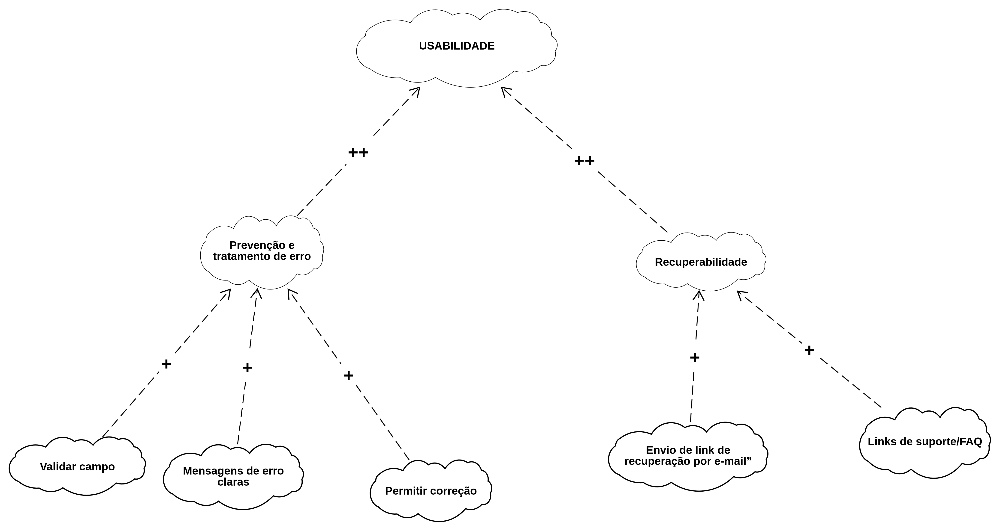

# NFR Framework — Usabilidade

## NFR01: Usabilidade

### 1. Introdução

O **NFR Framework (Non-Functional Requirements Framework)** é uma abordagem
utilizada para representar, analisar e organizar requisitos não funcionais
por meio de **Softgoal Interdependency Graphs (SIGs)**.

Diferentemente de requisitos funcionais, que descrevem funcionalidades que o
sistema deve executar, os requisitos não funcionais estão relacionados a
atributos de qualidade que devem ser considerados durante o desenvolvimento
da solução, como usabilidade, segurança, desempenho, confiabilidade e
manutenibilidade.

Para esta etapa do projeto, a **SubEquipe_01** selecionou o atributo de
qualidade **Usabilidade** para a construção do SIG.

A escolha está relacionada ao objetivo do projeto de desenvolver uma
plataforma de fórum voltada à **discussão e ao compartilhamento de
conhecimento**, tendo como referência a plataforma **TabNews** e considerando
aspectos de **Design Centrado no Usuário, Usabilidade e Experiência do Usuário
(UX)**.

O NFR foi desenvolvido de forma integrada ao artefato generalista produzido
pela subequipe, um **Rich Picture do fluxo de Login**.

Dessa maneira, o Rich Picture é utilizado como uma fonte para identificação
das preocupações relacionadas à interação do usuário, enquanto o NFR
Framework organiza essas preocupações como softgoals e operacionalizações.

---

## 2. Contexto da Análise

O recorte escolhido pela SubEquipe_01 para a elaboração dos artefatos foi o
**fluxo de Login de um fórum**, utilizando o **TabNews** como referência para
a compreensão do domínio e das interações existentes em uma plataforma de
discussão e compartilhamento de conhecimento.

O Login representa uma das principais portas de entrada do usuário na
plataforma. Por esse motivo, dificuldades relacionadas à compreensão da
interface, preenchimento dos campos, identificação de erros ou ausência de
feedback podem comprometer diretamente a experiência de utilização do sistema.

A análise realizada para a elaboração do Rich Picture permitiu identificar
diferentes elementos relacionados à interação do usuário com o processo de
autenticação.

Entre os principais aspectos considerados estão:

- identificação dos campos necessários para autenticação;
- preenchimento das credenciais;
- compreensão das informações apresentadas;
- identificação do botão de Login;
- feedback após a tentativa de autenticação;
- tratamento de credenciais inválidas;
- possibilidade de recuperação de acesso;
- consistência dos elementos da interface;
- facilidade de interação com o processo.

Esses aspectos foram utilizados como insumos para a definição do
**Softgoal de Usabilidade** e de seus respectivos softgoals.

---

## 3. Relação com o Rich Picture

O NFR Framework foi elaborado a partir das preocupações identificadas no
**Rich Picture do fluxo de Login**.

O Rich Picture apresenta uma visão geral e contextual do processo, enquanto o
NFR Framework permite aprofundar uma preocupação específica relacionada à
qualidade da interação.

Neste caso, a preocupação selecionada foi a **Usabilidade**.

A relação entre os dois artefatos pode ser representada da seguinte forma:

| Artefato | Função na análise |
|---|---|
| Rich Picture | Representar visualmente o contexto e as interações relacionadas ao Login |
| NFR Framework | Organizar e analisar as preocupações de qualidade identificadas no fluxo |
| SIG de Usabilidade | Representar a decomposição da Usabilidade em softgoals e operacionalizações |

Dessa forma, o NFR não é elaborado de maneira isolada, mas possui
rastreabilidade com o artefato generalista produzido anteriormente pela
subequipe.

---

## 4. Requisitos Não Funcionais

Os requisitos não funcionais apresentados nesta seção foram **derivados pela
SubEquipe_01** a partir da análise do fluxo de Login representado no Rich
Picture e da análise da plataforma de referência.

Eles constituem insumos para a construção do SIG de Usabilidade.

| Código | Requisito Não Funcional | Descrição |
| :---: | :--- | :--- |
| **RNF01** | **Facilidade de Uso** | A interface de Login deve apresentar uma estrutura simples e intuitiva, permitindo que o usuário compreenda facilmente como realizar o processo de autenticação. |
| **RNF02** | **Clareza das Informações** | Os campos, botões, rótulos e instruções apresentados durante o processo de Login devem possuir identificação clara e linguagem compreensível para o usuário. |
| **RNF03** | **Feedback ao Usuário** | O sistema deve fornecer feedback adequado após as ações realizadas pelo usuário durante o processo de Login, permitindo compreender o resultado da operação. |
| **RNF04** | **Prevenção e Tratamento de Erros** | O sistema deve auxiliar o usuário na identificação e correção de erros ocorridos durante o preenchimento ou autenticação das credenciais. |
| **RNF05** | **Recuperação de Acesso** | O sistema deve disponibilizar um mecanismo simples e compreensível para que o usuário possa recuperar o acesso à sua conta quando não possuir ou não lembrar suas credenciais. |
| **RNF06** | **Consistência da Interface** | A interface de Login deve manter padrões visuais e comportamentais consistentes com os demais elementos da plataforma. |

<center>
Autor: Arthur Fernandes (2026).
</center>

---

## 5. Softgoal Principal

### USABILIDADE

O softgoal principal do SIG desenvolvido pela SubEquipe_01 é:

> **USABILIDADE**

A Usabilidade representa a preocupação da equipe em proporcionar ao usuário
uma interação simples, compreensível, eficiente e previsível durante o
processo de Login.

Para representar essa preocupação de forma mais detalhada, o softgoal
principal foi decomposto em diferentes aspectos de qualidade.

---

## 6. Decomposição do Softgoal de Usabilidade

O softgoal **USABILIDADE** foi decomposto nos seguintes softgoals:

| Código | Softgoal | Descrição |
|---|---|---|
| SG01 | Facilidade de Uso | Permitir que o usuário compreenda e utilize o Login com pouca dificuldade |
| SG02 | Clareza das Informações | Garantir que informações, campos e ações sejam compreensíveis |
| SG03 | Feedback ao Usuário | Informar o resultado das ações realizadas |
| SG04 | Prevenção e Tratamento de Erros | Reduzir e auxiliar na correção de erros durante o Login |
| SG05 | Recuperação de Acesso | Permitir que o usuário recupere o acesso à conta |
| SG06 | Consistência | Manter padrões visuais e comportamentais previsíveis |

A decomposição permite analisar a Usabilidade sob diferentes perspectivas,
evitando tratá-la como uma característica única e abstrata.

---

## 7. SG01 — Facilidade de Uso

### Descrição

A **Facilidade de Uso** está relacionada à capacidade do usuário de
compreender e executar o processo de Login sem encontrar dificuldades
desnecessárias.

Uma interface de autenticação deve permitir que o usuário identifique
rapidamente o que precisa fazer e quais informações precisa fornecer.

### Aspectos considerados

- organização dos campos;
- identificação dos campos;
- disposição intuitiva dos elementos;
- linguagem simples;
- redução de ações desnecessárias;
- identificação clara da ação de Login.

### Operacionalizações

| Operacionalização | Objetivo |
|---|---|
| Organizar os campos de Login de forma intuitiva | Facilitar a compreensão da sequência de preenchimento |
| Utilizar rótulos claros | Permitir que o usuário identifique cada campo |
| Destacar a ação principal de Login | Facilitar a identificação da ação necessária |
| Evitar informações desnecessárias na tela | Reduzir a carga cognitiva durante a autenticação |

---

## 8. SG02 — Clareza das Informações

### Descrição

A **Clareza das Informações** está relacionada à capacidade da interface de
apresentar informações compreensíveis ao usuário durante o processo de
autenticação.

O usuário deve conseguir identificar o significado dos campos e das ações
sem precisar interpretar informações ambíguas.

### Aspectos considerados

- rótulos dos campos;
- instruções;
- textos dos botões;
- mensagens apresentadas pelo sistema;
- linguagem utilizada.

### Operacionalizações

| Operacionalização | Objetivo |
|---|---|
| Utilizar rótulos objetivos nos campos | Identificar claramente os dados esperados |
| Utilizar linguagem simples | Facilitar a compreensão das informações |
| Identificar claramente o botão de Login | Tornar a ação principal evidente |
| Utilizar mensagens compreensíveis | Evitar interpretações ambíguas |

---

## 9. SG03 — Feedback ao Usuário

### Descrição

O **Feedback ao Usuário** representa a necessidade de informar o resultado
das ações realizadas durante o processo de Login.

Após uma ação, o usuário deve conseguir compreender se ela foi processada,
se ocorreu algum erro ou se precisa realizar uma nova ação.

### Exemplos de feedback

- Login realizado com sucesso;
- credenciais inválidas;
- campo obrigatório não preenchido;
- erro durante a autenticação;
- processamento da solicitação.

### Operacionalizações

| Operacionalização | Objetivo |
|---|---|
| Apresentar mensagem de sucesso | Informar que a autenticação foi concluída |
| Apresentar mensagem de erro | Informar que a autenticação não foi concluída |
| Indicar campos inválidos | Facilitar a identificação do problema |
| Indicar processamento | Evitar que o usuário interprete a ausência de resposta como falha |
| Manter mensagens próximas ao contexto da ação | Facilitar a compreensão do feedback |

---

## 10. SG04 — Prevenção e Tratamento de Erros

### Descrição

O softgoal de **Prevenção e Tratamento de Erros** busca reduzir a ocorrência
de erros durante o preenchimento dos dados e auxiliar o usuário quando uma
falha ocorrer.

O tratamento adequado de erros é importante para evitar que o usuário fique
sem compreender o motivo pelo qual o Login não foi realizado.

### Operacionalizações

| Operacionalização | Objetivo |
|---|---|
| Validar campos antes do envio | Identificar problemas antes da autenticação |
| Indicar campos preenchidos incorretamente | Facilitar a localização do erro |
| Apresentar mensagens específicas | Explicar o problema ocorrido |
| Permitir correção dos dados | Possibilitar uma nova tentativa |
| Manter os dados válidos preenchidos quando possível | Evitar retrabalho desnecessário |

---

## 11. SG05 — Recuperação de Acesso

### Descrição

A **Recuperação de Acesso** está relacionada à possibilidade de o usuário
retomar o acesso à sua conta quando não lembrar suas credenciais.

Esse aspecto é importante porque a impossibilidade de acessar uma conta pode
interromper completamente a interação do usuário com a plataforma.

### Operacionalizações

| Operacionalização | Objetivo |
|---|---|
| Disponibilizar opção de recuperação de senha | Permitir que o usuário inicie o processo de recuperação |
| Identificar claramente a opção de recuperação | Facilitar sua localização |
| Informar as etapas da recuperação | Orientar o usuário durante o processo |
| Apresentar feedback durante a recuperação | Informar o resultado das ações realizadas |

---

## 12. SG06 — Consistência

### Descrição

A **Consistência** está relacionada à manutenção de padrões visuais e
comportamentais na interface de Login e nos demais elementos da plataforma.

A utilização de padrões consistentes reduz a necessidade de o usuário
aprender novamente como realizar ações semelhantes.

### Operacionalizações

| Operacionalização | Objetivo |
|---|---|
| Utilizar componentes visuais padronizados | Manter consistência visual |
| Padronizar campos de entrada | Tornar a interação previsível |
| Padronizar botões e ações | Facilitar o reconhecimento das funcionalidades |
| Manter padrões de navegação | Reduzir dúvidas durante a utilização |
| Utilizar identidade visual consistente | Integrar o Login ao restante da plataforma |

---

# 13. SIG — NFR Framework

O **Softgoal Interdependency Graph (SIG)** é a representação gráfica utilizada
pelo NFR Framework para demonstrar a decomposição de um requisito não funcional
em diferentes softgoals e suas respectivas operacionalizações.

Neste trabalho, o SIG foi desenvolvido a partir do requisito não funcional de
**Usabilidade**, aplicado ao fluxo de Login da plataforma de fórum.

O SIG representa a relação entre:

- o softgoal principal **Usabilidade**;
- os softgoals derivados;
- as operacionalizações associadas a cada softgoal;
- as contribuições entre os elementos do modelo.

A representação gráfica permite visualizar como diferentes decisões de desenho
podem contribuir para a satisfação do requisito de Usabilidade.

<center>
Figura 1 — SIG de Usabilidade aplicado ao fluxo de Login
</center>
<div align="center">




**Figura 1 — SIG de Usabilidade aplicado ao fluxo de Login**

**Autor:** Elaborado por Arthur Fernandes, Giovana Fontes e João (2026).

</div>

---

# 14. Relações no NFR Framework

No SIG, o softgoal principal **Usabilidade** é decomposto em diferentes
aspectos relacionados à experiência do usuário durante o processo de Login.

Cada softgoal representa uma preocupação específica de qualidade e possui
operacionalizações que podem contribuir para sua satisfação.

As contribuições positivas são representadas pelo símbolo **"+"**, indicando
que a operacionalização contribui positivamente para o softgoal relacionado.

| Origem | Relação | Destino | Justificativa |
|---|:---:|---|---|
| Organizar campos | + | Facilidade de Uso | A organização adequada facilita o preenchimento das informações. |
| Interface simples | + | Facilidade de Uso | A redução da complexidade facilita a interação do usuário. |
| Fluxo intuitivo | + | Facilidade de Uso | Permite que o usuário compreenda a sequência de ações necessárias. |
| Utilizar rótulos | + | Clareza das Informações | Permite identificar claramente o significado de cada campo. |
| Instruções claras | + | Clareza das Informações | Orienta o usuário durante o preenchimento. |
| Botões identificados | + | Clareza das Informações | Facilita a compreensão das ações disponíveis. |
| Mensagem de sucesso | + | Feedback ao Usuário | Informa que a autenticação foi concluída. |
| Mensagem de erro | + | Feedback ao Usuário | Informa que a autenticação não foi concluída. |
| Indicador de carregamento | + | Feedback ao Usuário | Informa que a solicitação está sendo processada. |
| Validar campos | + | Prevenção e Tratamento de Erros | Permite identificar problemas antes do envio dos dados. |
| Mensagens específicas | + | Prevenção e Tratamento de Erros | Auxilia o usuário a compreender o problema ocorrido. |
| Permitir correção | + | Prevenção e Tratamento de Erros | Permite corrigir os dados sem reiniciar o processo. |
| Recuperação de senha | + | Recuperação de Acesso | Permite que o usuário recupere o acesso à conta. |
| Orientação de recuperação | + | Recuperação de Acesso | Orienta o usuário durante o processo de recuperação. |
| Componentes padronizados | + | Consistência | Mantém padrões semelhantes entre os elementos da interface. |
| Padrões visuais consistentes | + | Consistência | Mantém coerência visual na plataforma. |
| Comportamento previsível | + | Consistência | Reduz incertezas durante a interação com a interface. |


---

# 15. Operacionalizações

As operacionalizações representam soluções, mecanismos ou decisões de desenho
que podem contribuir diretamente para a satisfação dos softgoals identificados
no SIG.

No contexto do fluxo de Login, as operacionalizações foram definidas a partir
das preocupações identificadas no Rich Picture e da análise do processo de
autenticação.

## 15.1. Facilidade de Uso

| Operacionalização | Aplicação no Login |
|---|---|
| Organizar campos | Dispor os campos de autenticação em uma sequência lógica e intuitiva. |
| Interface simples | Evitar elementos desnecessários na tela de Login. |
| Fluxo intuitivo | Permitir que o usuário compreenda naturalmente as etapas necessárias para acessar a plataforma. |

## 15.2. Clareza das Informações

| Operacionalização | Aplicação no Login |
|---|---|
| Utilizar rótulos | Identificar claramente os campos utilizados para autenticação. |
| Instruções claras | Orientar o usuário sobre as informações que devem ser fornecidas. |
| Botões identificados | Utilizar textos que representem claramente as ações disponíveis. |

## 15.3. Feedback ao Usuário

| Operacionalização | Aplicação no Login |
|---|---|
| Mensagem de sucesso | Informar ao usuário quando a autenticação for concluída. |
| Mensagem de erro | Informar quando a autenticação não puder ser realizada. |
| Indicador de carregamento | Informar que o sistema está processando a solicitação. |

## 15.4. Prevenção e Tratamento de Erros

| Operacionalização | Aplicação no Login |
|---|---|
| Validação dos campos | Verificar se os campos obrigatórios foram preenchidos corretamente. |
| Mensagens específicas | Indicar de forma compreensível o problema encontrado. |
| Permitir correção | Permitir que o usuário corrija os dados informados sem reiniciar o processo. |
| Preservar dados válidos | Evitar que o usuário precise preencher novamente informações que já estavam corretas. |

## 15.5. Recuperação de Acesso

| Operacionalização | Aplicação no Login |
|---|---|
| Recuperação de senha | Disponibilizar um mecanismo para recuperar o acesso à conta. |
| Orientação de recuperação | Apresentar instruções claras sobre como realizar a recuperação. |
| Feedback da recuperação | Informar ao usuário o resultado das ações realizadas durante a recuperação. |

## 15.6. Consistência

| Operacionalização | Aplicação no Login |
|---|---|
| Componentes padronizados | Utilizar componentes semelhantes aos demais elementos da plataforma. |
| Padrões visuais consistentes | Manter coerência visual com a identidade do fórum. |
| Comportamento previsível | Fazer com que os componentes apresentem comportamentos esperados pelo usuário. |

---

# 16. Justificativas

## 16.1. Facilidade de Uso

A **Facilidade de Uso** foi selecionada porque o Login representa uma das
primeiras interações do usuário com a plataforma.

Uma interface complexa ou com excesso de elementos pode dificultar o acesso ao
fórum. A organização dos campos, a simplicidade da interface e a definição de
um fluxo intuitivo contribuem para que o usuário consiga realizar a
autenticação sem dificuldades desnecessárias.

## 16.2. Clareza das Informações

A **Clareza das Informações** é importante porque o usuário precisa compreender
quais informações devem ser fornecidas e quais ações estão disponíveis.

Rótulos, instruções e identificação adequada dos botões reduzem ambiguidades
durante o preenchimento dos dados e facilitam a compreensão da interface.

## 16.3. Feedback ao Usuário

O **Feedback ao Usuário** permite que o usuário compreenda o resultado das
ações realizadas.

Durante uma tentativa de Login, por exemplo, o sistema deve permitir que o
usuário identifique se a autenticação foi realizada, se ocorreu algum erro ou
se a solicitação ainda está sendo processada.

## 16.4. Prevenção e Tratamento de Erros

A **Prevenção e Tratamento de Erros** contribui para reduzir problemas durante
o preenchimento das informações.

A validação dos campos e a apresentação de mensagens específicas permitem que
o usuário compreenda o problema e realize as correções necessárias.

## 16.5. Recuperação de Acesso

A **Recuperação de Acesso** foi considerada devido à possibilidade de o usuário
esquecer suas credenciais.

A existência de um mecanismo de recuperação reduz a dificuldade para retornar
à plataforma e evita que o usuário fique impossibilitado de acessar sua conta.

## 16.6. Consistência

A **Consistência** contribui para tornar o comportamento da interface mais
previsível.

A utilização de padrões visuais e comportamentais semelhantes aos demais
elementos do fórum permite que o usuário reconheça componentes e compreenda
mais rapidamente como interagir com eles.

---

# 17. Relação com o Rich Picture

O NFR Framework foi construído a partir das preocupações identificadas no
**Rich Picture do fluxo de Login**.

O Rich Picture apresenta uma visão contextual da interação entre o usuário e a
interface de autenticação. A partir desses elementos, foram identificadas
preocupações relacionadas à qualidade da interação, posteriormente
representadas como softgoals no SIG.

| Elemento do Rich Picture | Preocupação identificada | Softgoal relacionado |
|---|---|---|
| Campos de autenticação | Facilidade para preencher os dados | Facilidade de Uso |
| Identificação dos campos | Compreensão das informações | Clareza das Informações |
| Botão de Login | Compreensão das ações disponíveis | Clareza das Informações |
| Resultado da autenticação | Compreensão do resultado da ação | Feedback ao Usuário |
| Credenciais inválidas | Tratamento de situações de erro | Prevenção e Tratamento de Erros |
| Mensagens apresentadas ao usuário | Compreensão do problema | Prevenção e Tratamento de Erros |
| Recuperação da conta | Possibilidade de recuperar o acesso | Recuperação de Acesso |
| Organização dos componentes | Padronização da interface | Consistência |

Essa relação permite estabelecer rastreabilidade entre o artefato generalista e
o NFR Framework, demonstrando como as preocupações identificadas na análise
contextual foram utilizadas para orientar a definição dos softgoals.

---

# 18. Matriz de Rastreabilidade

A matriz de rastreabilidade permite relacionar os artefatos produzidos pela
subequipe e demonstrar como os elementos analisados em uma etapa serviram de
insumo para as etapas seguintes.

| Origem | Elemento identificado | NFR | Softgoal | Operacionalização |
|---|---|---|---|---|
| Rich Picture | Campos de autenticação | Usabilidade | Facilidade de Uso | Organizar campos |
| Rich Picture | Rótulos dos campos | Usabilidade | Clareza das Informações | Utilizar rótulos |
| Rich Picture | Instruções | Usabilidade | Clareza das Informações | Instruções claras |
| Rich Picture | Botão de Login | Usabilidade | Clareza das Informações | Botões identificados |
| Rich Picture | Resultado do Login | Usabilidade | Feedback ao Usuário | Mensagem de sucesso |
| Rich Picture | Resultado do Login | Usabilidade | Feedback ao Usuário | Mensagem de erro |
| Rich Picture | Processamento da solicitação | Usabilidade | Feedback ao Usuário | Indicador de carregamento |
| Rich Picture | Credenciais inválidas | Usabilidade | Prevenção e Tratamento de Erros | Validar campos |
| Rich Picture | Mensagens de erro | Usabilidade | Prevenção e Tratamento de Erros | Mensagens específicas |
| Rich Picture | Correção dos dados | Usabilidade | Prevenção e Tratamento de Erros | Permitir correção |
| Rich Picture | Recuperação da conta | Usabilidade | Recuperação de Acesso | Recuperação de senha |
| Rich Picture | Elementos da interface | Usabilidade | Consistência | Componentes padronizados |

A matriz demonstra a rastreabilidade desde o elemento observado no contexto do
Login até a solução de desenho representada como operacionalização no NFR
Framework.

---

# 19. Senso Crítico

A construção do SIG permitiu identificar diferentes aspectos de Usabilidade
relacionados ao processo de Login. Entretanto, o modelo possui algumas
limitações decorrentes do recorte adotado.

O principal recorte realizado foi concentrar a análise no **fluxo de Login**.
Dessa forma, o SIG não representa todos os requisitos de Usabilidade
existentes em uma plataforma de fórum.

Funcionalidades como publicação de conteúdos, comentários, navegação entre
discussões, pesquisa e interação entre usuários não foram consideradas neste
modelo, pois não fazem parte do fluxo analisado no Rich Picture desta
subequipe.

Outra limitação está relacionada ao fato de que o SIG representa preocupações
de qualidade e possíveis soluções, mas não substitui uma avaliação de
Usabilidade realizada com usuários reais.

Dessa forma, as operacionalizações apresentadas devem ser entendidas como
decisões e recomendações de desenho que poderão ser refinadas durante a
evolução do projeto.

Durante as próximas etapas, novos achados da Engenharia Reversa e da
Modelagem BPMN poderão contribuir para a revisão do SIG.

---

# 20. Considerações Finais

A utilização do NFR Framework permitiu representar de forma estruturada o
atributo de qualidade **Usabilidade** aplicado ao fluxo de Login analisado pela
subequipe.

A decomposição do softgoal principal em **Facilidade de Uso, Clareza das
Informações, Feedback ao Usuário, Prevenção e Tratamento de Erros, Recuperação
de Acesso e Consistência** possibilitou detalhar diferentes aspectos
relacionados à experiência do usuário.

As operacionalizações apresentadas estabelecem uma relação entre os
softgoals de qualidade e possíveis decisões de desenho para a interface.

Além disso, a relação estabelecida com o Rich Picture permite demonstrar a
rastreabilidade entre os artefatos produzidos, evitando que o SIG seja
construído de maneira isolada.

O modelo poderá ser refinado durante o desenvolvimento do projeto conforme
novos requisitos, decisões de desenho, resultados da Engenharia Reversa e
avaliações de Usabilidade sejam identificados.

---

# 21. Critérios de Avaliação do SIG

Para verificar a qualidade do modelo elaborado, foram definidos critérios de
avaliação relacionados às diretrizes da entrega.

| Critério | Verificação |
|---|---|
| Coerência com o projeto | O SIG está relacionado ao domínio de fórum e ao fluxo de Login analisado. |
| Coerência com o Rich Picture | Os softgoals estão relacionados às preocupações identificadas no artefato generalista. |
| Uso do NFR Framework | O modelo diferencia softgoals e operacionalizações. |
| Rastreabilidade | É possível relacionar os elementos do SIG aos elementos identificados anteriormente. |
| Clareza | A estrutura do SIG pode ser compreendida de maneira objetiva. |
| Justificativa | As decomposições e operacionalizações possuem justificativas. |
| Senso crítico | As limitações e decisões de recorte são apresentadas. |
| Evolução | O modelo pode ser refinado conforme novos achados sejam identificados. |

---

# 22. Estrutura Final do SIG

A estrutura conceitual consolidada do SIG desenvolvido pela SubEquipe_01 é
apresentada abaixo.

```text
                              [USABILIDADE]
                                    |
        +---------------------------+---------------------------+
        |                           |                           |
        v                           v                           v
[Facilidade de Uso]      [Clareza das Informações]    [Feedback ao Usuário]
        |                           |                           |
        |                           |                           |
        v                           v                           v
(Organizar campos)         (Utilizar rótulos)          (Mensagem de sucesso)
(Interface simples)        (Instruções claras)         (Mensagem de erro)
(Fluxo intuitivo)          (Botões identificados)      (Indicador de carregamento)


                              [USABILIDADE]
                                    |
                  +-----------------+-----------------+
                  |                                   |
                  v                                   v
[Prevenção e Tratamento de Erros]          [Recuperação de Acesso]
                  |                                   |
                  |                                   |
                  v                                   v
          (Validar campos)                    (Recuperação de senha)
          (Mensagens específicas)             (Orientação de recuperação)
          (Permitir correção)                 (Feedback da recuperação)


                              [USABILIDADE]
                                    |
                                    v
                              [Consistência]
                                    |
                 +------------------+------------------+
                 |                  |                  |
                 v                  v                  v
        (Componentes          (Padrões visuais    (Comportamento
         padronizados)         consistentes)       previsível)

```

A estrutura apresentada sintetiza a decomposição utilizada no SIG. O
softgoal Usabilidade representa a preocupação de qualidade principal,
enquanto os elementos derivados representam aspectos específicos da
experiência do usuário.

As expressões entre parênteses representam as operacionalizações, isto é,
as possíveis soluções ou decisões de desenho que contribuem para a satisfação
dos respectivos softgoals.

---

# Referências

> 1. CNYANG, Chung-Horng; MYLOPOULOS, John. **Non-Functional Requirements in Software Engineering**.

> 2. MYLOPOULOS, John; CHUNG, Lawrence; NIXON, Brian. **Representing and Using Nonfunctional Requirements: A Process-Oriented Approach**.

> 3. **NFR Framework**. Abordagem para modelagem e análise de requisitos não funcionais.

> 4. **TabNews**. Plataforma de conteúdo e discussões utilizada como referência para a análise do domínio de fóruns e compartilhamento de conhecimento.

> 5. **NFR Framework — SIG (Softgoal Interdependency Graph)**. Material de referência sobre a representação de Softgoal Interdependency Graphs (SIGs) e a aplicação do NFR Framework. Disponível em: [https://requisitos-de-software.github.io/2025.2-Grupo04/Entregas/Entregas_04/Modelagem_II/NFR_Framework/](https://requisitos-de-software.github.io/2025.2-Grupo04/Entregas/Entregas_04/Modelagem_II/NFR_Framework/). Acesso em: 27 ago. 2026.

> 6. **Non-Functional Requirements in Software Engineering — Google Books**. Material bibliográfico utilizado como referência para o estudo de requisitos não funcionais e do NFR Framework. Disponível em: [https://books.google.com.br/books?id=MNrcBwAAQBAJ&pg=PA65&hl=pt-PT&source=gbs_selected_pages&cad=1#v=onepage&q&f=false](https://books.google.com.br/books?id=MNrcBwAAQBAJ&pg=PA65&hl=pt-PT&source=gbs_selected_pages&cad=1#v=onepage&q&f=false). Acesso em: 27 ago. 2026.

> 7. DSM3-GOALS. **DSM3-goals: NFR Framework, iStar 2.0 e KAOS Goal Models**.
   Material de referência para modelagem orientada a objetivos, incluindo a
   representação de requisitos não funcionais, softgoals,
   operacionalizações, refinamentos e relações de contribuição. Disponível em:
   [https://www.cin.ufpe.br/~jhcp/dsm3goals/index.html](https://www.cin.ufpe.br/~jhcp/dsm3goals/index.html).
   Acesso em: 27 ago. 2026.

---

# Histórico de Versões

| Versão | Data | Descrição | Autor(es) | Revisor(es) | Detalhe da Revisão |
| :---: | :---: | :--- | :---: | :---: | :--- |
| 1.0 | 25/08/2026 | Criação do documento de NFR Framework — Usabilidade | [Arthur Fernandes](https://github.com/arthurfernandesj) | [Giovana Fontes](https://github.com/GiovanaFontesS) | Documento criado com a definição do softgoal de Usabilidade e sua aplicação ao fluxo de Login. |
| 1.1 | 26/08/2026 | Refinamento da estrutura do SIG | [Arthur Fernandes](https://github.com/arthurfernandesj) | [Giovana Fontes](https://github.com/GiovanaFontesS) | Inclusão da decomposição de Usabilidade, operacionalizações, relações de contribuição, matriz de rastreabilidade, senso crítico e critérios de avaliação. |
| 1.2 | 27/08/2026 | Organização e correção do documento | [Arthur Fernandes](https://github.com/arthurfernandesj) | [Giovana Fontes](https://github.com/GiovanaFontesS) | Correção da numeração das seções, organização das relações do NFR Framework, revisão das operacionalizações, consolidação da estrutura do SIG e ajustes de formatação em Markdown. |
| 1.3 | 27/08/2026 | Ampliação das referências bibliográficas | [Arthur Fernandes](https://github.com/arthurfernandesj) | [Giovana Fontes](https://github.com/GiovanaFontesS) | Inclusão de referências bibliográficas e materiais complementares utilizados para fundamentar o NFR Framework e a representação de Softgoal Interdependency Graphs (SIGs). |