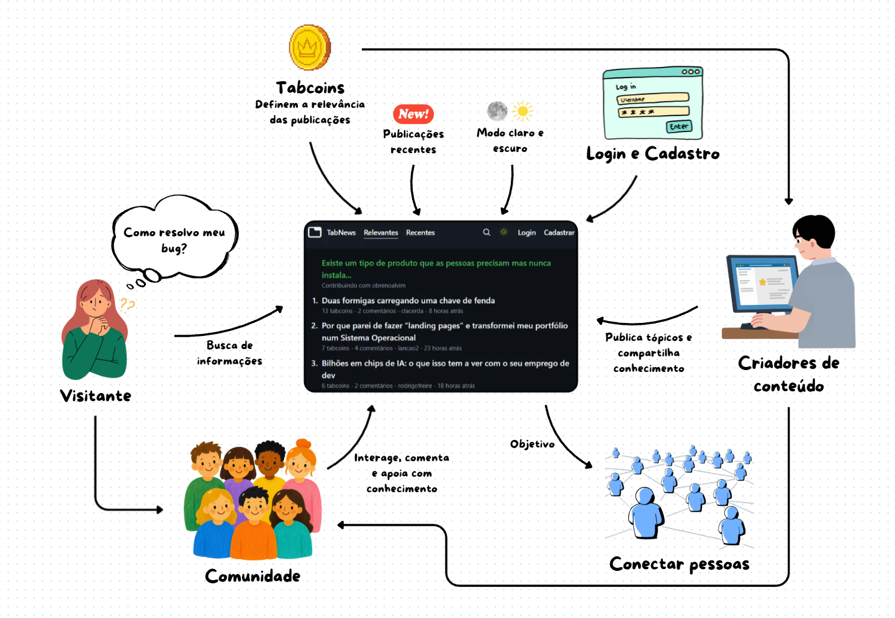

# Artefato Generalista 

# Introdução

Neste módulo, foi elaborado um artefato generalista com o objetivo de fornecer uma base para a compreensão e o desenvolvimento do projeto **TabNews**.

| **#** | **Artefato** | **Descrição** |
|---|---|---|
| 1 | [**Mapa Mental**]() | Estruturação visual do escopo da tela inicial do projeto |

*Tabela 1 — Artefato generalista produzido neste módulo.*

### Participantes

| Matrícula  | Aluno                                                  | Participação                        |
| ---------- | :----------------------------------------------------- | :---------------------------------- |
| 19/0088885 | [Isaac Menezes Pereira](https://github.com/pratamz250) | Elaboração e revisão do Mapa Mental |
| 23/1029841 | [Pablo Rodrigues Lima](https://github.com/Pablo-R-L)   | Elaboração e revisão do Mapa Mental |
| 22/2031680 | [Pedro Ramos Sousa Reis](https://github.com/PedroRSR)  | Elaboração e revisão do Mapa Mental |

*Tabela 2 — Participante neste módulo.*

## Justificativa da escolha

A escolha pelo mapa mental se dá devido à facilidade da visualização e compreensão tanto dos membros da equipe quanto para terceiros.

# Objetivo do Documento

O objetivo é delimitar de forma clara as funcionalidades envolvidas na tela inicial do TabNews, facilitando o entendimento do fluxo e servindo como base para a análise, prototipação e desenvolvimento dessa dela.

### Mapa Mental

O [**Mapa Mental**]() foi desenvolvido para organizar visualmente os principais elementos e funcionalidades da tela inicial do **TabNews**, permitindo compreender de forma mais clara a estrutura dessa tela. Foram relacionados aspectos como usuários, publicações, comentários, categorias, interações e demais funcionalidades presentes no sistema.

Além de facilitar a visualização das relações entre os diferentes componentes da aplicação, o artefato serviu como apoio para a identificação e organização dos requisitos. Dessa forma, o Mapa Mental contribuiu para que a equipe tivesse uma visão mais ampla do funcionamento do TabNews e pudesse utilizar essas informações como base para as etapas seguintes do projeto.

*Figura 1 — Mapa Mental da Tela Inicial do TabNews. Elaborado por [Pedro Ramos](https://github.com/PedroRSR).*

## Análise

O mapa mental permitiu organizar de forma visual e hierárquica os principais elementos relacionados à tela inicial do **TabNews**, concentrando, em um único artefato, a relação e o papel dos visitantes e dos criadores de conteúdo com o sistema e como eles formam uma comunidade, o funcionamento das TabCoins e das informações na tela e, por fim, o objetivo da página.

## Relação com os demais artefatos

O Mapa Mental funciona como um ponto de partida para os demais artefatos
produzidos pela subequipe. A partir dele, a tela inicial do TabNews é
organizada em atores, funcionalidades, interações e objetivos, facilitando a
identificação dos requisitos e dos fluxos do sistema.

| Artefato | Relação |
| -------- | ------- |
| NFR Framework | Elementos como o modo claro e escuro, a organização das publicações, a busca e a navegação, identificados no Mapa Mental, fundamentam os requisitos de conforto ocular, usabilidade e navegação. |
| Engenharia Reversa | O Mapa Mental registra características observadas no TabNews, como publicações, TabCoins, comunidade e participação dos criadores, que podem orientar a análise do fórum de referência. Entretanto, o documento de Engenharia Reversa da Subequipe 2 ainda não foi preenchido. |
| Modelagem BPMN | Os caminhos e interações representados no Mapa Mental são convertidos em fluxos de processo, como acessar a página, visualizar e reorganizar publicações, pesquisar, realizar login ou cadastro e acessar posts e comentários. |
| IA Generativa | A IA Generativa foi utilizada como apoio para compreender e organizar visualmente as relações do sistema por meio de uma imagem inicial. O resultado foi revisado criticamente e serviu de referência para a elaboração do Mapa Mental, sem substituir a análise da equipe. |

## Histórico de Versões

| Versão | Data | Descrição | Autor(es) | Revisor(es) | Detalhe da Revisão |
| :---: | :---: | :--- | :---: | :---: | :--- |
| 1.0 | 27/08/2026 | Criação da página de Artefato Generalista | [Pedro Ramos](https://github.com/PedroRSR) |  [Isaac Menezes Pereira](https://github.com/pratamz250) |  |
| 1.1 | 27/08/2026 | Correção da imagem e adição de novas informações | [Isaac Menezes Pereira](https://github.com/pratamz250), |  [Pablo Rodrigues Lima](https://github.com/Pablo-R-L) | Correção da imagem que estava com bug e não estava aparecendo e adição de novas informações |
| 1.2 | 27/08/2026 | Revisão da página de Artefato Generalista | [Pablo Rodrigues Lima](https://github.com/Pablo-R-L) | [Pedro Ramos](https://github.com/PedroRSR) | Revisão do conteúdo, verificando a coerência, organização e clareza das informações apresentadas, com ajustes necessários para aprimorar a documentação.  |