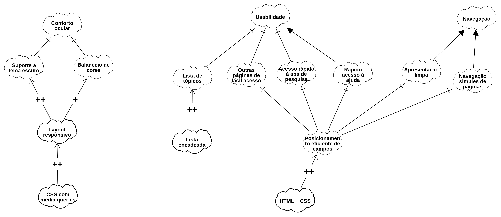

# NFR Framework 

O NFR Framework é usado para representar, lidar e especificar requisitos não funcionais de um sistema. Uma vez elicitados, é possível, como o framework, operacionalisá-los e definir suas depências concretas.
A ferramenta funciona com o chamado SIG (Softgoal Interdependency Graph) que permite definir etapas de conclusões, sendo essas totalmente contribuintes, parcialmente contribuintes, negativamente contribuintes, etc.

Para esse relatório foram elicitados requisitos não funcionais que descrevem usabilidade e navegação. Esses se tornam softgoals e entram nos ditames do framework. Após tratados, são transformados em passos concretos.

## NFR01: Conforto ocular

### Descrição

O usuário deve ter bom conforto ocular ao usar o Fórum. A intenção é que a usabilidade seja algo leve e longevo.

---

## Contexto

A análise da necessidade de conforto ocular foi feita a partir de análises do Fórum. Foi constatado que é um dos objetivos da ferramenta. Para isso, o usuário tem a sua disposição:

- opção de modo noturo;
- contraste simples de cores;
- organização de elementos da página;
- pouco contraste de cores.

---

### NFR02: Usabilidade

### Descrição

A ferramenta deve oferecer usabilidade simplificada ao usuário. Abas úteis deve estar a disposição. A organização geral da página deve ser satisfeita. 

### Contexto

Ao navegar no Fórum, o usuário deve ser capaz de voltar para o ponto de partida, o anterior, ou mesmo navegar até uma página útil fora de seu fluxo (mas que pertença à ferramenta). A análise do Fórum evidenciou, como prova a intenção de boa usabilidade:

- FAQ disponível no final da página;
- Barra de pesquisa no topo da página;
- Páginas precedentes e sucessivas de fácil acesso.

### NFR03: Navegação

### Descrição

O usuário deve ser capaz de se localizar no Fórum sem muitas dificuldades; de avançar ou retroceder a partir da sua respectiva página.

### Contexto

Ao analisar o Fórum, é possível navegar sem intromissões ou perdas de fluxo. Observou-se as seguintes evidências dessa intenção:

- Páginas seguintes ou passadas listas em lista;
- Botão de Anterior e Próximo destacados;
- Demais tópicos de interesse listados em lista encadeada.

## Requisitos Não Funcionais Candidatos

A partir da análise geral da plataforma, foram identificados os seguintes requisitos não funcionais candidatos (softgoals) para compor o SIG.

### RNF01 — Suporte a tema escuro

O usuário é capaz de alternar entre temas melhorando sua usabilidade em diferentes horários do dia.

### RNF02 — Balancio de cores

As cores do sistema são simples. Em geral, o branco e preto fornecem bom equilíbrio.

### RNF03 — Lista de tópicos

O sistema fornece uma lista de tópicos de discussão de interesse organizados em lista.

### RNF04 — Demais páginas de fácil acesso

O sistema fornece, ao final de cada página, rápido acesso à páginas seguintes e passadas.

### RNF05 — Rápido acesso à aba de pesquisa

O sistema fixa a barra de pesquisa no topo de cada página.

### RNF06 — Rápido acesso à Ajuda

O sistema fixa a Ajuda (ou FAQ) no final de cada página.

### RNF07 — Aprensentação limpa

O sistema aprenseta seus elementos (campos, opções e labels) de maneira previsível e estruturada.

### RNF08 — Simples navegação de páginas

O sistema lista as páginas seguintes e antecessoras no final de cada respectiva página.

### RNF09 — Posicionamento eficiente de campos

Contribuindo com a navegação em geral, os campos são eficientemente organizados em posições previsíveis e padronizadas.

---

## SIG — Usabilidade e Navegação

O SIG representa a decomposição dos softgoals **Conforto Ocular**, **Usabilidade** e **Navegação** em diferentes aspectos e operacionalizações técnicas relacionados à interação do usuário com o Fórum.

<b>Figura 1</b> — SIG de Usabilidade, Conforto Ocular e Navegação

Fonte: Integrantes da SubEquipe_01 (2026).

---

## Decomposição do Softgoal e Operacionalizações

O SIG apresenta três grandes ramos independentes de softgoals de alto nível: Conforto Ocular, Usabilidade e Navegação.

### 1. Ramo: Conforto Ocular

O softgoal **Conforto Ocular** busca reduzir a fadiga visual dos usuários. Ele é refinado por:

#### Softgoals Refinados:

- **Suporte a tema escuro**: Possibilitar a inversão de cores para ambientes com pouca luz.
- **Balanceio de cores**: Utilizar esquemas de cores harmônicos e de baixo contraste excessivo.

#### Operacionalizações:

- **Layout responsivo**: O grafo indica que o uso de um layout responsivo contribui para a implementação do suporte a tema escuro e do balanceio de cores.
- **CSS com média queries**: Esta é a técnica base que operacionaliza o layout responsivo.

---

### 2. Ramo: Usabilidade

O softgoal **Usabilidade** representa o objetivo de proporcionar facilidade no acesso às informações centrais do Fórum. Ele é decomposto nos seguintes aspectos:

#### Softgoals Refinados:

- **Lista de tópicos**: Facilidade na visualização e acesso à lista de discussões.
- **Outras páginas de fácil acesso**: Garantir acesso rápido a páginas complementares.
- **Acesso rápido à aba de pesquisa**: Facilitar a localização de conteúdo.
- **Rápido acesso à ajuda**: Disponibilizar suporte ao usuário de forma ágil.
- **Posicionamento eficiente de campos**: Posicionar os campos e labels do Fórum em locais previsíveis e organizados.

#### Operacionalizações:

- **Lista encadeada**: Solução para operacionalizar a organização e exibição da **Lista de tópicos** (com contribuição positiva).
- **Posicionamento eficiente de campos**: Solução técnica que operacionaliza diretamente o **Acesso rápido à aba de pesquisa** e o **Rápido acesso à ajuda** (ambos com contribuição positiva). Também contribui para o softgoal **Outras páginas de fácil acesso**.
- **HTML + CSS**: Técnica base que operacionaliza o **Posicionamento eficiente de campos**.

---

### 3. Ramo: Navegação

O softgoal **Navegação** foca na facilidade de movimento do usuário dentro da plataforma. Ele é decomposto nos seguintes aspectos:

#### Softgoals Refinados:

- **Apresentação limpa**: Interface organizada e sem excesso de elementos visuais.
- **Navegação simples de páginas**: Facilidade para alternar entre as páginas de tópicos e listagens.

#### Operacionalizações:

- **Posicionamento eficiente de campos**: O grafo indica que esta solução operacionaliza diretamente a **Apresentação limpa** e a **Navegação simples de páginas**.
- **HTML + CSS**: Programação condinzente para fornecer responsividade.

---

## Operacionalizações

As operacionalizações representam as soluções técnicas que contribuem para a satisfação dos softgoals identificados.

| Operacionalização | Softgoals Impactados Diretamente (Contribuição Positiva) | Técnica de Base |
|---|---|---|
| **Layout responsivo** | Suporte a tema escuro, Balanceio de cores | CSS com média queries |
| **Lista encadeada** | Lista de tópicos | Lista encadeada de novos tópicos |
| **Posicionamento eficiente de campos** | Outras páginas de fácil acesso, Acesso rápido à aba de pesquisa, Rápido acesso à ajuda, Apresentação limpa, Navegação simples de páginas | HTML + CSS |

---

## Relações no NFR Framework

No SIG, as operacionalizações representam decisões técnicas (nuvens com bordas grossas) que contribuem para a satisfação dos softgoals (nuvens com bordas finas).

As relações apresentadas no SIG utilizam a notação do **NFR Framework** para representar as contribuições:

- **Contribuição Positiva (+)**: A operacionalização ou o softgoal refinado ajuda a satisfazer o softgoal de nível superior (ex: Posicionamento eficiente de campos contribui positivamente para o Rápido acesso à ajuda).
- **Decomposição**: O softgoal de alto nível é quebrado em sub-softgoals mais específicos (ex: Usabilidade decomposta em Lista de tópicos, Pesquisa, etc.).
- **Relação de Operacionalização (seta em ângulo)**: Indica como uma solução técnica satisfaz um ou mais softgoals (ex: HTML + CSS operacionaliza o Posicionamento eficiente de campos).

A representação gráfica permite observar como decisões técnicas (como o uso de CSS com média queries ou uma estrutura de lista encadeada) impactam diretamente atributos de qualidade centrais como Conforto Ocular e Usabilidade.

---

## Justificativas

Abaixo estão as justificativas para a inclusão dos elementos presentes no grafo:

### Conforto Ocular

O **Conforto Ocular** foi considerado essencial devido ao Fórum ser um ambiente de leitura. O suporte a temas escuros e o balanceio de cores são cruciais para reduzir a fadiga visual, especialmente em uso prolongado. O **Layout responsivo** foi indicado como contribuinte para esses aspectos, e o **CSS com média queries** como a técnica para alcançá-lo.

### Usabilidade

A **Usabilidade** focada no acesso à informação é a justificativa para decompor o softgoal em acesso à **Lista de tópicos**, **Pesquisa** e **Ajuda**. A **Lista encadeada** foi considerada a melhor forma de organizar os tópicos. O **Posicionamento eficiente de campos** é justificado pela necessidade de acesso imediato às ferramentas de pesquisa e ajuda.

### Navegação

A **Navegação** fluida justifica a decomposição em **Apresentação limpa** e **Navegação simples de páginas**. O **Posicionamento eficiente de campos** é justificado como uma solução técnica que garante que os elementos de navegação estejam organizados de forma clara e visível.

---

## Rastreabilidade

O NFR de Usabilidade e Navegação possui relação direta com as necessidades identificadas na análise geral da plataforma do Fórum.

| Origem | Elemento analisado | Relação com o NFR |
|---|---|---|
| Necessidade do Usuário | Leitura prolongada | Conforto Ocular (Suporte a tema escuro, Balanceio de cores) |
| Estrutura do Fórum | Exibição de posts | Usabilidade (Lista de tópicos, Lista encadeada) |
| Necessidade de Busca | Localização de conteúdo | Usabilidade (Acesso rápido à aba de pesquisa) |
| Necessidade de Suporte | Dúvidas dos usuários | Usabilidade (Rápido acesso à ajuda) |
| Facilidade de Uso | Estrutura da interface | Navegação (Apresentação limpa, Navegação simples de páginas) |
| Decisão Técnica | CSS/Layout | Operacionalizações (Layout responsivo, Posicionamento eficiente de campos) |

---

## Senso Crítico

A construção do SIG foi realizada considerando as prioridades identificadas pela equipe para a usabilidade geral do Fórum.

Este SIG foca fortemente em aspectos visuais, de layout e de acesso imediato à informação, não abrangendo, por exemplo, a usabilidade de fluxos específicos como cadastro ou recuperação de senha.

Os requisitos e operacionalizações apresentados nesta etapa são considerados candidatos e podem ser refinados ou alterados conforme o levantamento detalhado de requisitos, a análise de plataformas de referência e a evolução do projeto.

---

## Considerações Finais

A utilização do NFR Framework possibilitou representar de maneira estruturada as preocupações relacionadas à **Usabilidade, Navegação e Conforto Ocular** no Fórum.

A partir das necessidades de visualização, busca e movimentação dos usuários, foram identificados softgoals e possíveis operacionalizações técnicas, estabelecendo uma base para decisões futuras de desenho da interface e da solução.

Dessa forma, o NFR de Usabilidade contribui para manter o foco do projeto na **experiência do usuário**, alinhando as decisões técnicas (como o uso de layout responsivo e posicionamento de campos) às necessidades de leitura e navegação identificadas.

---

## Referências

1. WASHIZAKI, H. (Ed.). OLszewska, J. I. **Guide to the Software Engineering Body of Knowledge (SWEBOK Guide), Version 4.0**. Piscataway, NJ: IEEE Computer Society, 2024. 413 p. Disponível em: https://www.swebok.org. Acesso em: 26 ago. 2026.

2. da Silva, Reinaldo Antônio. **NFR4ES: Um Catálogo de Requisitos Não-Funcionais para Sistemas Embarcados**. Universidade Federal de Pernambuco, 2019. 30 p. Disponível em: https://repositorio.ufpe.br/handle/123456789/34150. Acesso em: 25 ago. 2026.

3. **TabNews**. Plataforma utilizada como referência para análise do domínio de fóruns e compartilhamento de conhecimento. Disponível em: <https://www.tabnews.com.br/>.

---

## Histórico de Versões

| Versão | Data | Descrição | Autor(es) | Revisor(es) | Detalhe da Revisão |
| :---: | :---: | :--- | :---: | :---: | :--- |
| 1.0 | 25/08/2026 | Reestruturação e adaptação do NFR Framework | [Isaac Menezes](https://github.com/pratamz250) | [Pedro Ramos](https://github.com/PedroRSR)  | Documento atualizado para alinhar o texto com o SIG correspondente, contemplando Conforto Ocular, Usabilidade e Navegação. |