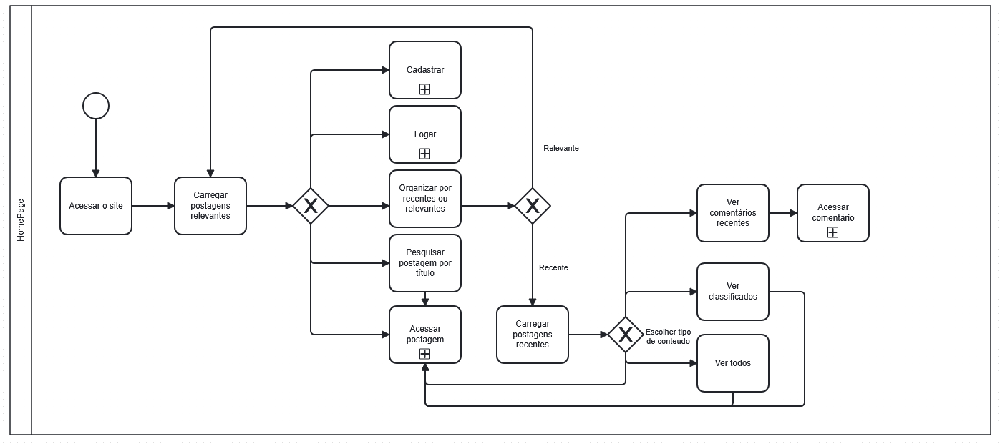
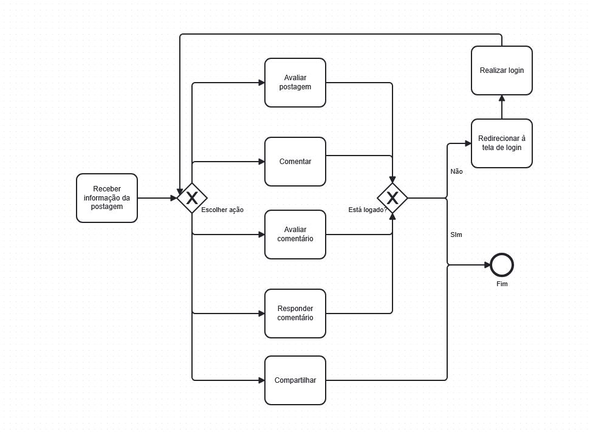
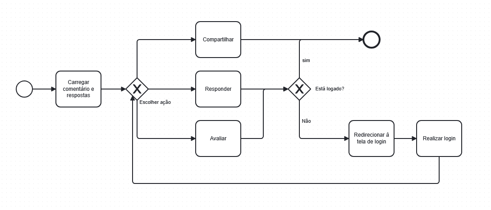
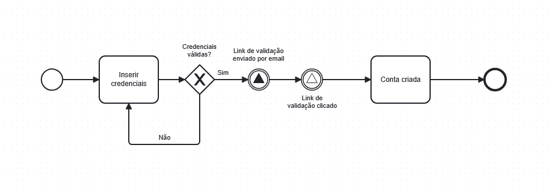

# 1.2.2. Modelagem BPMN

## Notação BPMN

A *Business Process Model and Notation* (BPMN) é uma notação padronizada
utilizada para a modelagem de processos, permitindo representar
graficamente as atividades, eventos, decisões e interações existentes em
um determinado fluxo.

A notação é mantida pela *Object Management Group* (OMG) e busca fornecer
uma representação compreensível tanto para pessoas envolvidas na definição
dos processos quanto para profissionais responsáveis pelo desenvolvimento
e implementação de sistemas.

A BPMN utiliza elementos gráficos padronizados para representar o fluxo de
um processo, facilitando a compreensão das atividades realizadas, dos
participantes envolvidos, das decisões tomadas e das informações
manipuladas durante a execução.

No contexto do projeto **Fórum**, a BPMN será utilizada como parte da
atividade de **Engenharia Reversa**, tendo o **TabNews** como plataforma de
referência.

A modelagem busca representar processos identificados durante a análise da
plataforma de referência, permitindo compreender como determinadas
funcionalidades são organizadas e como ocorre a interação entre o usuário
e o sistema.

---

## Participantes da Modelagem BPMN

**Tabela 1 — Participantes da elaboração da Modelagem BPMN**

| Matrícula | Aluno |
| :---: | :--- |
| 231029841 | Pablo Rodrigues |
|

---

## Processo Selecionado para Modelagem

A modelagem BPMN será realizada a partir dos processos identificados durante
a **Engenharia Reversa do TabNews**.

O processo selecionado para a modelagem deve apresentar um fluxo
significativo da plataforma, permitindo representar as principais
interações entre usuário e sistema.

Para esta etapa, será considerado o seguinte processo:

### Fluxo da tela inicial

O fluxo da tela inicial mostra as diversas opções que o usuário possui assim 
que acessa o site.

O processo contempla, de forma geral:

1. acesso ao site;
2. carregamento das postagens para display;
3. cadastro ou login;
4. reorganização das postagens;
5. acesso às postagens;

Aqui a modelagem BPMN é usada para estruturar este fluxo e representar a 
experiencia do usuário evidenciando suas opções.

---

## Modelagem BPMN

### BPMN do Fluxo da tela inicial

O diagrama abaixo representa o fluxo da tela incial.

#### Subprocesso Acessar postagens:

#### Subprocesso Acessar comentário:

#### Subprocesso Cadastro: 

### Descrição do fluxo

O processo é iniciado quando o usuário acessa a plataforma.

Em seguida, as postagens mais relevantes no momento são expostas ao usuário junto a uma 
série de escolhas que ele pode fazer.

O usuário pode: Acessar/Criar sua propria conta, Reorganizar as postagens como preferir, 
pesquisar por uma psotagem específica e
acessar postagens, comentários ou postagens classificadas

---

## Conclusão

A modelagem BPMN da tela inicial do TabNews permite representar de forma clara o 
fluxo de interação do usuário com o sistema, desde o acesso à página até a visualização 
e seleção dos conteúdos. O diagrama facilita a compreensão das etapas do processo 
e das decisões envolvidas, contribuindo para uma visão mais organizada do funcionamento da interface.

---

## Referências

> SERRANO, Milene. **Arquitetura e Desenho de Software — Aula BPMN
> Exemplos**. Universidade de Brasília — UnB.

> TABNEWS. **TabNews**. Plataforma utilizada como referência para a análise
> do domínio de fóruns e compartilhamento de conhecimento. Disponível em:
> <https://www.tabnews.com.br/>.

---

## Histórico de Versões

| Versão | Data | Descrição | Autor(es) | Revisor(es) | Detalhes da Revisão |
| :---: | :---: | :--- | :---: | :---: | :--- |
| 1.0 | 26/08/2026 | Criação do diagrama BPMN | [Pablo Rodrigues Lima](https://github.com/Pablo-R-L) | Pedro Ramos Sousa Reis | Criação do diagrama BPMN referente ao fluxo do usuário na tela inicial, com sua posterior adição ao repositório de imagens para facilitar a organização e utilização do material no projeto. |
| 1.1 | 27/08/2026 | Criação da página BPMN.md | [Isaac Menezes](https://github.com/pratamz250) | Pablo Rodrigues | Criação do documento referente à modelagem BPMN, com a organização e descrição dos fluxos representados, além da adição dos diagramas à página para facilitar sua visualização e compreensão. |
| 1.2 | 27/08/2026 | Ajustes | [Pedro Ramos Sousa Reis](https://github.com/PedroRSR) | Isaac | Ajustes em pontos importantes do relatório que necessitavam de maior esclarecimento, realizando correções e complementações para garantir que o documento estivesse em coerência com as diretrizes estabelecidas para a Entrega 1. |
| 1.3 | 28/08/2026 | Adição do hístorico | [Pedro Ramos Sousa Reis](https://github.com/PedroRSR) | Pablo Rodrigues | Adição do histórico de versões conforme as diretrizes da Entrega 1. |