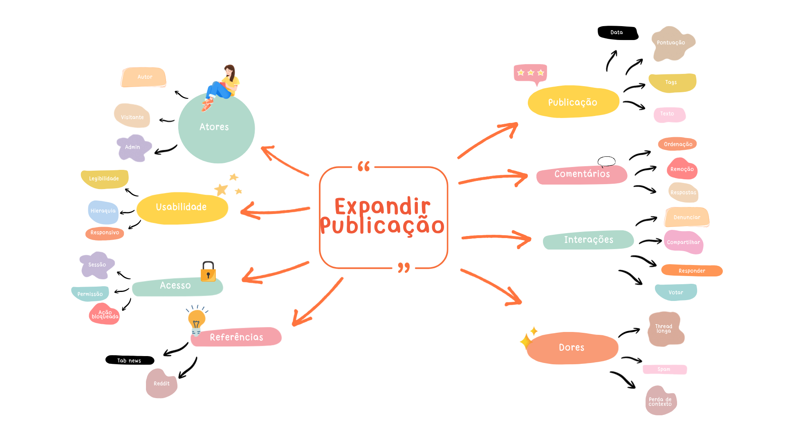

# Artefato Generalista — Mapa Mental

## Introdução

Este documento apresenta o artefato generalista elaborado pela **Subequipe_03** no âmbito do Módulo Base, referente ao Foco 1 da Entrega 1. Artefatos generalistas são independentes da metodologia de desenvolvimento adotada e servem como base para a compreensão inicial do contexto em estudo.

O recorte da subequipe é a **tela de expandir uma publicação** do Fórum: a interface exibida quando o usuário abre um post e visualiza o conteúdo completo acompanhado da árvore de comentários.

| **#** | **Artefato** | **Descrição** |
|---|---|---|
| 1 | [**Mapa Mental**](#mapa-mental) | Levantamento geral e radial dos elementos envolvidos no contexto da tela de expandir publicação |

*Tabela 1 — Artefato generalista produzido pela Subequipe_03.*

### Participantes

| Matrícula | Aluno | Participação |
| --------- | ----- | ------------ |
| 22/1022060 | Leonardo Bonetti | Elaboração e documentação do Mapa Mental |

*Tabela 2 — Participação dos membros na elaboração do artefato.*

---

## Justificativa da escolha do artefato

As diretrizes da Entrega 1 estabelecem como mínimo, para o Foco 1, a produção de um artefato generalista — Rich Picture **ou** Mapa Mental — acompanhado de um SIG na notação do NFR Framework. A Subequipe_03 optou pelo **Mapa Mental**.

A escolha se justifica pela natureza da etapa em que a subequipe se encontrava. Segundo Buzan e Buzan (1993), o mapa mental é uma técnica de pensamento radiante: parte de um conceito central e ramifica associações livres, privilegiando palavras-chave, cores e imagens em detrimento de texto corrido. Trata-se, portanto, de uma ferramenta de **levantamento**, adequada a momentos de brainstorming e anotação coletiva, e não de uma ferramenta de especificação.

Como a subequipe precisava, antes de qualquer modelagem, mapear o universo que orbita a tela de detalhamento de publicação, quem atua nela, o que ela exibe, quais ações permite, que problemas de uso apresenta e que sistemas resolvem o mesmo problema , o mapa mental foi a técnica mais aderente. Um Rich Picture, por sua vez, teria exigido decisões prematuras sobre atores e fluxos que ainda não estavam consolidadas nesse momento do trabalho.

### Delimitação do escopo

**Dentro do escopo:** elementos exibidos na tela de detalhamento, ações disponíveis ao usuário nessa tela, restrições de acesso percebidas nela, problemas de experiência específicos da leitura e discussão de um post, e sistemas de referência que resolvem essa mesma tela.

---

## Mapa Mental

*Figura 1 — Mapa Mental da tela de expandir publicação (Subequipe_03).*

### Elaboração

O artefato foi construído em ferramenta digital de diagramação, partindo do conceito central **"Expandir Publicação"** e ramificando em oito eixos de associação. Foram observadas as recomendações de Buzan e Buzan (1993) para a técnica: nó central destacado, ramos irradiando a partir dele, uso de palavras-chave isoladas em lugar de frases, emprego de mais de três cores para agrupar ideias afins e inclusão de elementos pictóricos.

O agrupamento cromático não segue a sequência dos ramos, mas sua natureza: elementos de conteúdo e de identidade recebem uma família de cores; ações e comportamentos, outra; restrições e origens, outra; e aspectos de qualidade e problemas, outra. A cor agrupa, não numera.

### Ramos levantados

| Ramo | Palavras-chave | O que o ramo levanta |
|---|---|---|
| **Atores** | Autor · Visitante · Admin | Quem atua na tela e com que papel |
| **Publicação** | Data · Pontuação · Tags · Texto | O que a tela exibe do conteúdo principal |
| **Comentários** | Ordenação · Remoção · Respostas | Como a discussão se organiza abaixo do post |
| **Interações** | Votar · Responder · Compartilhar · Denunciar | O que o usuário pode fazer a partir da tela |
| **Acesso** | Sessão · Permissão · Ação bloqueada | Restrições percebidas ao tentar interagir |
| **Dores** | Thread longa · Spam · Perda de contexto | Problemas de experiência próprios dessa tela |
| **Referências** | TabNews · Reddit | Sistemas que resolvem a mesma tela |
| **Usabilidade** | Legibilidade · Hierarquia · Responsivo | Qualidades esperadas da interface |

*Tabela 3 — Ramos do mapa mental e seu conteúdo.*

---

## Análise

O levantamento evidenciou que a tela de expandir publicação concentra elementos de três naturezas distintas, o que justifica sua complexidade dentro do projeto.

A primeira é a **exibição de conteúdo**, representada pelos ramos Publicação e Comentários. A tela não apresenta um objeto único, mas uma composição: um conteúdo principal acompanhado de uma estrutura de discussão com regras próprias de ordenação e remoção.

A segunda é a **interação condicionada**, evidenciada pela vizinhança entre os ramos Interações e Acesso. O levantamento registrou que a tela oferece ações ao usuário, mas que essas ações encontram restrições de sessão e permissão. O mapa mental apenas registra a coexistência desses dois conjuntos; a natureza exata dessa relação — em que momento a restrição se manifesta — não é objeto deste artefato e foi investigada na Engenharia Reversa, sendo posteriormente formalizada na modelagem BPMN.

A terceira é a **qualidade de experiência**, agrupada nos ramos Dores e Usabilidade. Esses dois ramos foram deliberadamente posicionados de forma adjacente e com o mesmo tratamento cromático, por constituírem faces complementares do mesmo problema: as dores levantadas descrevem falhas de experiência e as qualidades de usabilidade descrevem o que se espera em seu lugar. Esse par é o principal insumo do SIG de Usabilidade elaborado no NFR Framework pela mesma subequipe.

Por fim, o ramo **Referências** cumpre função metodológica: registra que a subequipe não partiu do zero, mas observou sistemas maduros que resolvem essa mesma tela, o que fundamenta a Engenharia Reversa conduzida sobre o TabNews.

---

## Relação com os demais artefatos

O Mapa Mental é o artefato de entrada da Subequipe_03: seu produto é o levantamento inicial que alimenta os demais artefatos da entrega.

| Artefato | Relação |
| -------- | ------- |
| NFR Framework (SIG) | Os ramos Dores e Usabilidade fornecem os softgoals e as operacionalizações que estruturam o SIG de Usabilidade. |
| Engenharia Reversa | O ramo Referências registra os sistemas observados; os demais ramos delimitam o que precisava ser investigado na análise do TabNews. |
| Modelagem BPMN | Os ramos Interações e Acesso identificam as ações e as restrições que, uma vez detalhadas pela Engenharia Reversa, tornam-se atividades e gateways no modelo de processo. |
| IA Generativa | Ferramentas de IA generativa apoiaram a organização e a revisão do artefato, com validação crítica dos resultados pela equipe. |

*Tabela 4 — Relação do Mapa Mental com os demais artefatos da Entrega 1.*

---

## Referências Bibliográficas

> **BUZAN, Tony; BUZAN, Barry.** *The Mind Map Book: How to Use Radiant Thinking to Maximize Your Brain's Untapped Potential.* London: BBC Books, 1993.

> **SERRANO, Milene.** *Material didático da disciplina Arquitetura e Desenho de Software (FGA0208).* Universidade de Brasília, Faculdade de Ciências e Tecnologias em Engenharia, 2026.

---

## Histórico de Versões

| Versão | Data | Descrição | Autor(es) | Revisor(es) | Detalhe da Revisão |
| :---: | :---: | :--- | :---: | :---: | :--- |
| 1.0 | 27/08/2026 | Criação do documento de Artefato Generalista da Subequipe_03 | [Leonardo Bonetti](https://github.com/LeoFacB) |  [Arthur Fernandes](https://github.com/arthurfernandesj)| Estrutura inicial do documento, com justificativa da escolha e delimitação de escopo. |
