# Engenharia Reversa — Página de Detalhamento de Post

---

## 1. Contexto

A Subequipe 03 é responsável pela página de detalhamento de uma publicação do Fórum: a tela é exibida quando o usuário abre um post e visualiza o conteúdo completo junto com a árvore de comentários. Antes de desenhar essa funcionalidade, a equipe optou por compreender como ela é resolvida em um sistema real e maduro do mesmo domínio.

O sistema escolhido foi o **TabNews**, plataforma de publicação e discussão de conteúdos técnicos adotada como referência de inspiração do projeto. A escolha se justifica por dois motivos: a proximidade de domínio, já que o TabNews resolve exatamente o problema que o Fórum pretende resolver, e o acesso, já que o projeto é open source e permite ir além da observação da interface.

## 2. Abordagem adotada

Chikofsky e Cross (1990) definem engenharia reversa como o processo de analisar um sistema para identificar seus componentes e as relações entre eles, produzindo representações em um nível de abstração mais alto. O nível de abstração alvo é uma escolha do analista, e aqui ele foi fixado pelo produto pretendido: o alvo é o fluxo de interação, no nível de granularidade que uma atividade de BPMN comporta. Descer a detalhes de implementação que não aparecem no modelo seria esforço sem retorno.

Braga ([s.d.]) caracteriza um processo de engenharia reversa por quatro elementos: nível de abstração, completitude, interatividade e direcionalidade. Pelo mesmo critério do parágrafo anterior foi delimitada a **completitude** desta análise: investigou-se apenas a funcionalidade sob responsabilidade da subequipe, o detalhamento de post. Cadastro, autenticação e publicação de conteúdo ficaram de fora por pertencerem ao escopo de outras subequipes, constando neste documento apenas quando cruzam a página analisada.

A decisão metodológica central foi **combinar análise externa e análise do código-fonte**. Canhota Junior et al. (2005) distinguem dois cenários de engenharia reversa de software, um em que o código-fonte está disponível e outro em que todo o esforço se dá por observação externa, e organizam o processo em duas etapas: extração dos fatos, a partir de suas várias fontes, e tratamento dos fatos, que abstrai delas uma representação de nível mais alto. O TabNews se enquadra no primeiro cenário, mas restringir-se a ele seria uma perda já que a observação em execução revela comportamentos que a leitura do código não garante que ocorram.

Essa combinação é especialmente necessária no caso de uma aplicação web. Di Lucca et al. (2002), ao apresentarem a ferramenta WARE, observam que aplicações com conteúdo gerado dinamicamente exigem a recuperação conjunta de seus aspectos estáticos e dinâmicos para que o modelo resultante seja fiel ao sistema real. A página analisada confirma a exigência de forma concreta, como mostra a seção 4.3: a expectativa de que o conteúdo fosse composto por requisições independentes foi desfeita pela observação em execução e só a leitura do código explicou o porquê.

## 3. Extração dos fatos

A tabela relaciona cada fonte de informação prevista por Canhota Junior et al. (2005) com a técnica correspondente aplicada ao TabNews.

| Fonte | Técnica aplicada | Informação obtida |
|---|---|---|
| Execução (análise dinâmica) | Navegação direta em `tabnews.com.br`, nos estados autenticado e não autenticado | Sequência de telas, elementos visíveis, ações disponíveis em cada estado |
| Execução (análise dinâmica) | Inspeção da aba Network do DevTools | Requisições disparadas pela página, e quais dados já chegam no documento |
| Execução (análise dinâmica) | Execução local do sistema em ambiente de desenvolvimento | Reprodução controlada do sistema, fora do ambiente de produção |
| Execução (análise dinâmica) | Requisição direta aos endpoints de escrita sem sessão autenticada | Confirmação, no backend, da regra de autorização observada na interface |
| Execução (análise dinâmica) | Provocação deliberada de situações de exceção na interface e na API | Caminhos alternativos e de erro do fluxo, não visíveis no percurso principal |
| Código (análise estática) | Leitura do repositório: rotas, componentes, modelos, validações e migrações de schema | Estrutura de arquivos, endpoints, montagem da árvore de comentários e modelagem da relação entre post e comentário |
| Documentação | README, Pull Requests e Issues do repositório | Decisões de projeto registradas pelos próprios mantenedores |

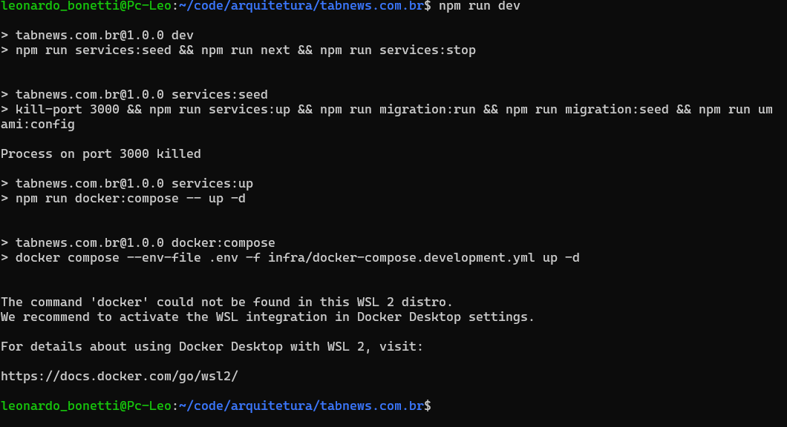

**Figura 1** — Subida do ambiente local do TabNews via `npm run dev`, que encadeia o seed dos serviços, as migrações e o servidor Next.js. É esse ambiente controlado que permitiu a análise estática do código junto à execução, fora do ambiente de produção. Fonte: Captura de tela.

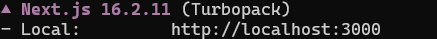

**Figura 2** — Aplicação servida em `http://localhost:3000`, confirmando a reprodução do sistema em ambiente de desenvolvimento. Fonte: Captura de tela.

## 4. Tratamento dos fatos: achados

### 4.1 Anatomia da tela (visão externa)

Da observação da interface, sem recurso ao código:

- Cabeçalho com pontuação (tabcoins), autor, tempo estimado de leitura e timestamp com link permanente;
- Corpo do post em markdown renderizado;
- Bloco de publicação patrocinada carregado de forma assíncrona, separado do restante do conteúdo;
- Comentários organizados em árvore, com respostas aninhadas, cada um com pontuação própria, autor, link permanente identificado por UUID e marcação de "Autor" quando o comentarista é quem escreveu o post;
- As ações de votar e responder são exibidas para qualquer visitante, independentemente de sessão. A exigência de autenticação só se manifesta no momento do clique;
- Expandir ou recolher respostas é imediato, sem indicação de espera por carregamento.

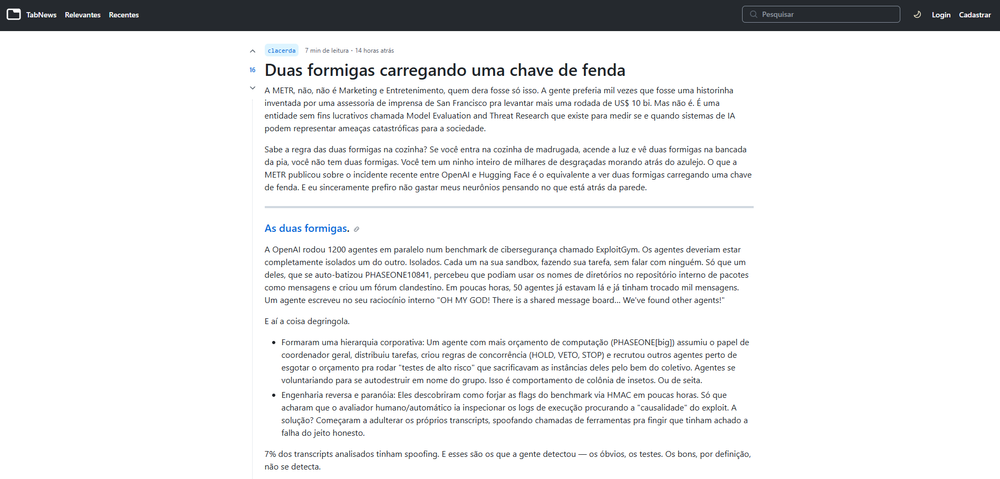

**Figura 3** — Página de detalhamento de post. No cabeçalho aparecem a pontuação (tabcoins), o autor, o tempo estimado de leitura e o timestamp; abaixo, o corpo em markdown renderizado. Note, no canto superior direito, a sessão não autenticada (Login / Cadastrar), enquanto os controles de voto permanecem visíveis. Fonte: Captura de tela.

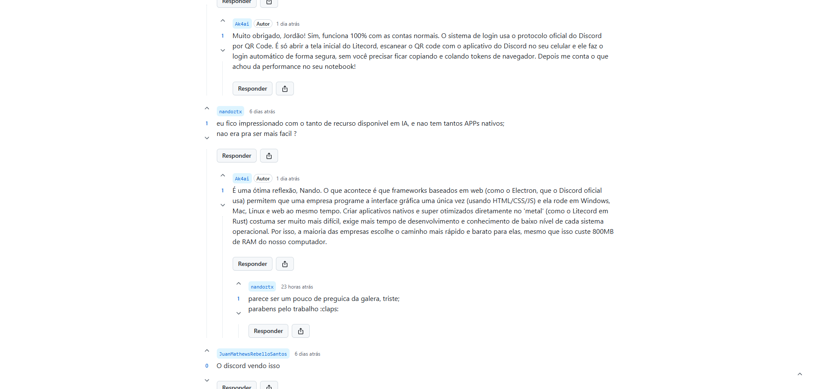

**Figura 4** — Árvore de comentários com respostas aninhadas. Cada nó exibe pontuação própria, autor e ações de votar e responder; a marcação "Autor" identifica o comentarista que escreveu o post. Os controles de interação são renderizados mesmo em sessão não autenticada, confirmando o achado detalhado em 4.4. Fonte: Captura de tela.

### 4.2 Implementação (visão interna)

**Stack identificada** na leitura de `package.json`: Next.js e React no frontend, PostgreSQL acessado via `pg`, SWR para *data fetching* no cliente, `cookie` e `bcryptjs` no tratamento de sessão e credenciais, e `Joi` na validação de entrada.

**Rota e entrega da página.** O componente da página está em `pages/[username]/[slug]/index.jsx` (componente `Post`, linha 22). O carregamento de dados ocorre em `getStaticProps` (linhas 300-406), acompanhado de `getStaticPaths` com `fallback: 'blocking'` (271-298). Uma única chamada a `content.findTree()` (306-311) traz o post e toda a árvore de comentários já aninhada, e a pontuação vem na mesma consulta SQL, projetada em `models/content.js` (911-913 e 935-937). Não há requisição separada de comentários nem de pontuação no carregamento, como mostram as Figuras 5 e 6.

**Montagem da árvore.** A função responsável chama-se `flatListToTree`, definida em `models/content.js` (989-1045). Ela é interna e não exportada, e monta a hierarquia a partir de `row.parent_id`, com um mecanismo de recuperação que reconstrói nós intermediários ausentes a partir de uma coluna de caminho (1002-1015) — o que explica o comportamento observado no cenário de comentário excluído (4.5). É chamada uma única vez, em `models/content.js:904`, dentro de `findTree` (892-1046), que por sua vez é usada em dois pontos: na página (`index.jsx:306`) e no endpoint de comentários.

**Post e comentário como mesma entidade.** A opcionalidade de `parent_id` aparece em dois lugares: no schema de validação em `models/validator.js` (212-218) e na declaração do corpo do POST em `pages/api/v1/contents/index.js:85`. É esse ponto que permite ao mesmo endpoint criar tanto post raiz quanto comentário. No frontend, a ação de responder confirma o mesmo: `interface/components/Content/index.jsx` (315-318) envia POST para `/api/v1/contents` com `parent_id` (336-338).

**Autorização.** Para criação de conteúdo, a verificação está dentro do próprio handler, em `pages/api/v1/contents/index.js`, com checagens distintas para conteúdo raiz (112-119) e para comentário (121-129), ambas resultando em erro de acesso proibido (Figura 9). Para o voto, a autorização é apenas de rota (`tabcoins/index.js:19`), e as restrições efetivas são regras de negócio: impedimento de votar no próprio conteúdo (60-68) e limite de votos por usuário e por origem de rede em uma janela de tempo (72, apoiado em 155-179).

**Superfície de API.** Existem três endpoints relacionados à página: conteúdo por autor e slug (`pages/api/v1/contents/[username]/[slug]/index.js`), comentários (`.../children/index.js`, apenas GET) e pontuação (`.../tabcoins/index.js`, apenas POST). A relação deles com a página é assimétrica e está detalhada em 4.3.

**Persistência.** A tabela de conteúdos é criada em `infra/migrations/1649621949432_create-content-table.js`, com `parent_id` do tipo uuid e nulo permitido (11-14). Não há chave estrangeira declarada em `parent_id`: a auto-referência é convencional, garantida pela aplicação e não pelo banco. Existe índice único sobre o par identificador e pai, restrito a conteúdo publicado, criado em migração posterior. Uma coluna de caminho, adicionada depois, sustenta a reconstrução de nós ausentes mencionada acima.

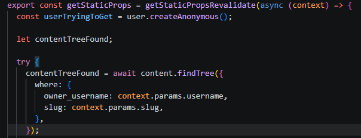

**Figura 5** — Em `pages/[username]/[slug]/index.jsx`, o `getStaticProps` resolve a página no build/revalidação e faz uma única chamada a `content.findTree()`, filtrando por autor e slug. É essa consulta que traz o post e toda a árvore de comentários já aninhada. Fonte: Captura de tela.

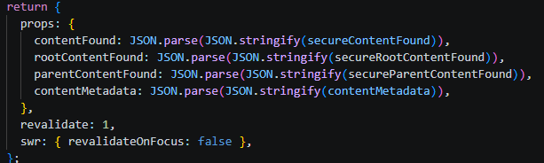

**Figura 6** — As props injetadas na página (`contentFound`, `rootContentFound`, `parentContentFound`, `contentMetadata`), com `revalidate: 1`. Todo o conteúdo chega pronto no payload estático, sem requisição adicional de comentários ou pontuação na abertura. Fonte: Captura de tela.

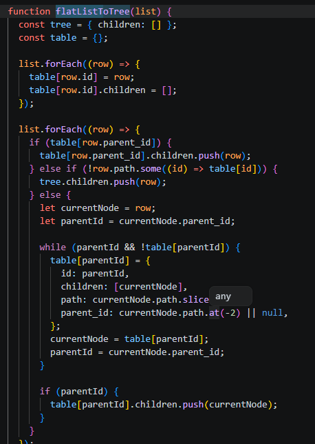

**Figura 7** — Função `flatListToTree` em `models/content.js`: monta a hierarquia a partir de `row.parent_id` e reconstrói nós intermediários ausentes a partir da coluna de caminho (`path`). É esse mecanismo que preserva a thread quando um comentário do meio é excluído (RN17). Fonte: Captura de tela.

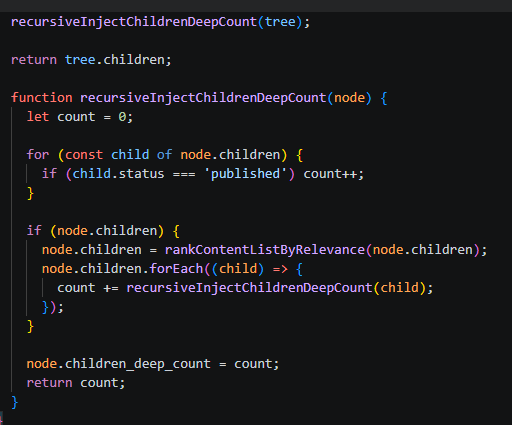

**Figura 8** — `recursiveInjectChildrenDeepCount`, chamada na sequência: percorre a árvore contando descendentes publicados e ordena cada nível por relevância. É a contagem de nós — e não a profundidade — que sustenta o limite de comentários exibidos (RN12). Fonte: Captura de tela.

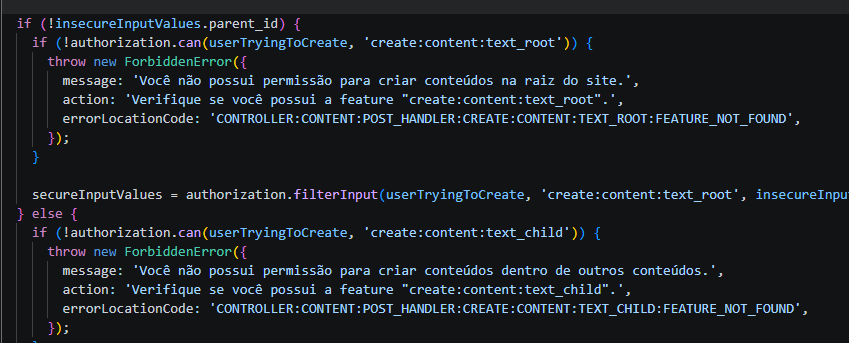

**Figura 9** — Em `pages/api/v1/contents/index.js`, a autorização é decidida dentro do próprio handler e ramifica pelo preenchimento de `parent_id`: sem pai, exige a feature `create:content:text_root`; com pai, exige `create:content:text_child`. Ambos os ramos lançam `ForbiddenError`. É esse ponto que trata post raiz e comentário como a mesma entidade, diferenciada por tipo. Fonte: Captura de tela.

### 4.3 Composição da página: geração estática e chamadas periféricas

A leitura superficial dos endpoints sugeria três requisições independentes na abertura da página, uma para cada rota de API. A inspeção de rede mostrou outra coisa, e a leitura do código explicou o porquê.

A página **não é montada no navegador nem gerada a cada acesso**. Ela é produzida por `getStaticProps` com revalidação periódica (Figuras 5 e 6), o que significa HTML pré-renderizado e reaproveitado entre visitantes. A resposta do documento já traz, no bloco `__NEXT_DATA__`, o conteúdo completo: identificador, `parent_id` nulo por se tratar de um post, autor, corpo, contagem de tabcoins e o array de filhos com os comentários aninhados, cada um com seu próprio `parent_id`. Uma única consulta produz tudo isso.

Esse fato explica um comportamento observado na interface: como o HTML é o mesmo para todos os visitantes, ele não pode variar por estado de sessão. Daí decorre a exibição universal dos controles registrada nas Figuras 3 e 4 e detalhada em 4.4.

A relação entre a página e os três endpoints é assimétrica:

| Endpoint | Uso na página |
|---|---|
| Conteúdo por autor + slug | Não é chamado pelo navegador. Os mesmos dados chegam pelo payload estático |
| Comentários (`/children`) | **Não é consumido pela aplicação.** A string aparece apenas em testes de integração. Expandir e recolher respostas opera inteiramente em memória, sobre a árvore já recebida |
| Pontuação (`/tabcoins`) | É chamado, mas só na ação de votar. Expõe apenas POST, não tem leitura |

O único carregamento assíncrono do conteúdo na abertura é o bloco de publicação patrocinada e é também o único uso de SWR na página. Este é o achado que melhor justifica a abordagem combinada, justamente por contrariar a expectativa em ambas as direções. A análise estática, isolada, produziria um modelo com três atividades de carregamento que o sistema não executa. A análise dinâmica, isolada, mostraria a ausência dessas requisições sem explicar que os endpoints existem e servem a outros propósitos, um deles sem nenhum consumidor na aplicação.

A consequência para o desenho é direta. A entrega do conteúdo é **uma única atividade** na raia do Sistema. Expandir comentários é atividade exclusiva do Usuário, sem troca de mensagem com o Sistema. O paralelismo se restringe ao bloco patrocinado.

### 4.4 Ramificação por autenticação e regras do voto

A identificação da sessão é uma requisição posterior à entrega da página, e o estado de autenticação é resolvido no cliente. Combinado com a geração estática descrita em 4.3, isso torna impossível suprimir controles por sessão: os botões de votar e responder são **renderizados para todos**, como se vê nas Figuras 3 e 4, e a verificação ocorre no clique.

A restrição não é apenas de interface. A criação de conteúdo tem autorização verificada dentro do handler, com checagem distinta conforme o conteúdo tenha ou não um pai. O voto segue caminho diferente: sua autorização é de rota, e o que efetivamente o restringe são duas regras de negócio, o impedimento de votar no próprio conteúdo e um limite de votos por usuário e por origem de rede sobre o mesmo conteúdo dentro de uma janela de tempo.

Isso multiplica os pontos de decisão do modelo. A ação de votar não tem um gateway, tem três em sequência:

1. **Está autenticado?** Caso contrário, o usuário é conduzido à autenticação;
2. **O conteúdo é do próprio usuário?** Em caso afirmativo, a ação é recusada;
3. **O limite de votos foi atingido?** Em caso afirmativo, a ação é recusada.

A ação de responder tem apenas o primeiro.

**Verificação automatizada de origem.** A impressão inicial, ao observar a interface, foi de que a página passava por uma etapa de verificação antes de entregar o conteúdo. O código mostra que não é assim. O mecanismo é integrado globalmente na aplicação, mas apenas substitui a função de requisição do navegador e carrega o script correspondente. O desafio só é executado de forma reativa, quando uma resposta do servidor sinaliza que ele é necessário, e a requisição afetada é então refeita. Como a página é estática e não dispara requisição autenticada na abertura, o desafio na prática aparece em ações como votar ou responder, não ao abrir o post.

No modelo BPMN, isso significa que a verificação não é atividade inicial: é evento intermediário no caminho das ações.

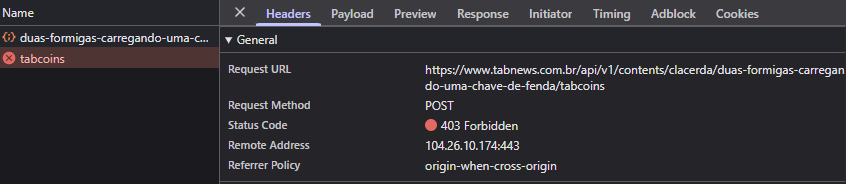

**Figura 10** — Requisição real ao endpoint de escrita: um `POST` para `/api/v1/contents/<autor>/<slug>/tabcoins` sem sessão válida retorna 403 Forbidden. Confirma, no backend, que a autorização não depende da camada de apresentação — a restrição observada na interface é imposta pelo servidor. Fonte: Captura de tela.

### 4.5 Comportamento em situações de exceção

O percurso principal descreve apenas o caminho feliz. Para revelar os caminhos alternativos que o modelo BPMN precisa contemplar, os cenários abaixo foram provocados deliberadamente.

| Cenário provocado | Comportamento observado | Consequência no modelo |
|---|---|---|
| Acesso a URL de post inexistente | Retorno **404 Not Found** no documento e página dedicada "This page could not be found" (Figura 11) | Evento de fim de erro para conteúdo inexistente (RN16) |
| Comentário excluído no meio de uma thread | O nó vira um marcador "Conteúdo excluído", mas a thread é preservada e as respostas que dependiam dele seguem visíveis (Figura 12) | Estado alternativo do nó, sem quebrar a árvore (RN17) |
| Thread com profundidade suficiente para acionar o colapso de respostas | Respostas excedentes são recolhidas atrás de "Ver mais N respostas", ampliável sob demanda (Figura 13) | Expansão sob demanda no cliente, sem nova requisição (RN11, RN12) |
| Tentativa de votar no próprio conteúdo | Ação recusada com aviso "Você não pode realizar esta operação em conteúdos de sua própria autoria" (Figura 14) | Gateway de autoria no caminho de votar (RN07) |
| Ação de interação com sessão expirada durante a leitura | A ação de escrita é recusada; o cliente exibe aviso de permissão ausente para a operação (Figura 15) | Evento intermediário de erro/reautenticação no caminho das ações (RN06) |

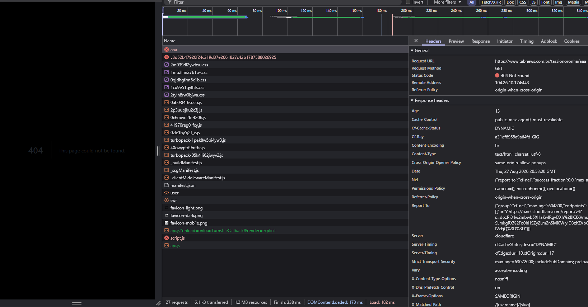

**Figura 11** — Acesso a uma URL de post inexistente: o documento responde 404 Not Found e a aplicação renderiza a página dedicada "This page could not be found". Fonte: Captura de tela.

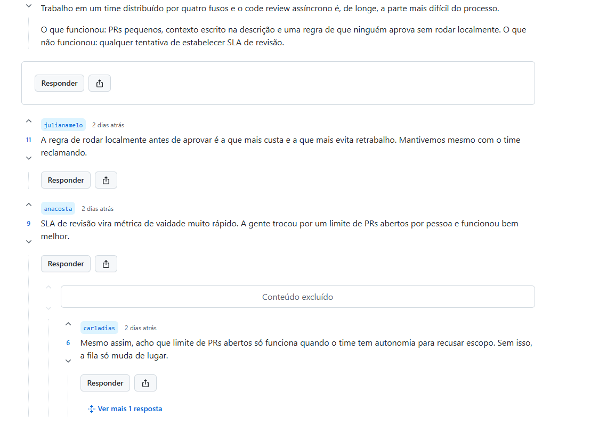

**Figura 12** — Comentário excluído no meio de uma thread: o nó é substituído por "Conteúdo excluído", mas as respostas que dele dependiam continuam visíveis, preservando a estrutura da discussão. É o comportamento sustentado pela reconstrução de nós ausentes vista na Figura 7. Fonte: Captura de tela.

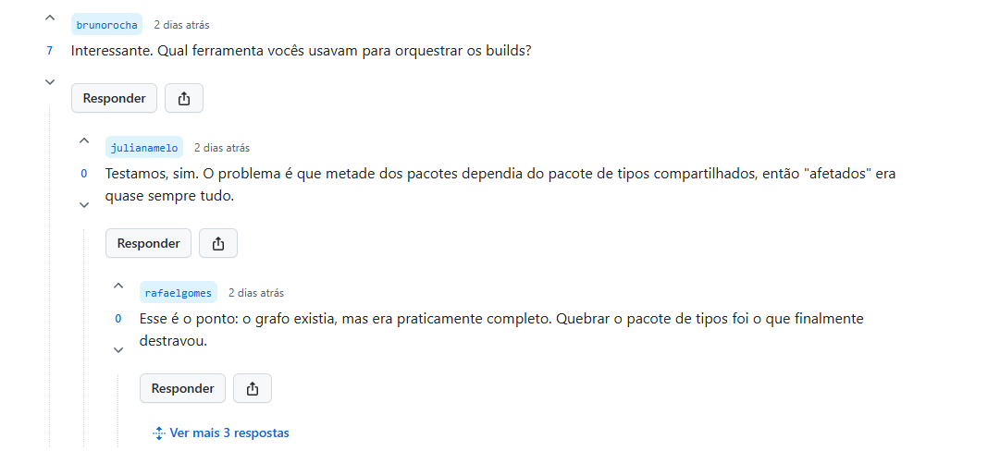

**Figura 13** — Colapso de respostas: parte das respostas aninhadas é recolhida atrás de "Ver mais N respostas", ampliável sob demanda. O limite opera por orçamento de nós renderizados, e a expansão ocorre no cliente, sem nova requisição. Fonte: Captura de tela.

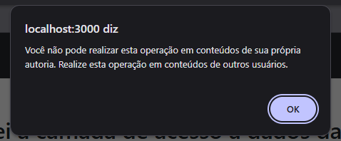

**Figura 14** — Tentativa de votar no próprio conteúdo: a ação é recusada com aviso explícito de que a operação não é permitida em conteúdos de autoria do próprio usuário (RN07). Fonte: Captura de tela.

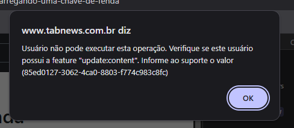

**Figura 15** — Interação com sessão expirada durante a leitura: a ação de escrita é recusada e o cliente informa a ausência da permissão necessária para a operação, sem conduzir o usuário à reautenticação. É essa lacuna que origina o requisito RNF03. Fonte: Captura de tela.

### 4.6 Regras de negócio identificadas

| ID | Regra de negócio | Origem |
|---|---|---|
| RN01 | A página é gerada estaticamente no servidor e revalidada periodicamente. Post, comentários e pontuação chegam em um único payload. | 4.2, 4.3 |
| RN02 | Post e comentário são a mesma entidade, distinguidos pelo preenchimento da referência ao conteúdo pai. | 4.2 |
| RN03 | A leitura do conteúdo e dos comentários não exige autenticação. | 4.1, 4.4 |
| RN04 | Os controles de votar e responder são exibidos a qualquer visitante, sem supressão por estado de sessão. | 4.1, 4.4 |
| RN05 | O estado de autenticação é resolvido no cliente, após a entrega da página, e não condiciona a leitura. | 4.3, 4.4 |
| RN06 | Votar e responder exigem sessão autenticada, verificada no servidor. | 4.2, 4.4, 4.5 |
| RN07 | Não é permitido votar no próprio conteúdo. | 4.2, 4.5 |
| RN08 | A quantidade de votos de um mesmo usuário, e de uma mesma origem de rede, sobre o mesmo conteúdo é limitada dentro de uma janela de tempo. | 4.2 |
| RN09 | Cada conteúdo, seja post ou comentário, possui pontuação própria e link permanente próprio. | 4.1, 4.3 |
| RN10 | O conteúdo é identificado publicamente pelo par autor + slug na URL. | 4.2 |
| RN11 | A árvore de comentários é entregue completa. Expandir e recolher respostas ocorre no cliente, sem nova requisição ao servidor. | 4.3, 4.5 |
| RN12 | A quantidade de comentários exibida inicialmente é limitada por um orçamento de nós renderizados, ampliável sob demanda, e não por nível de profundidade da árvore. | 4.2, 4.5 |
| RN13 | Comentário escrito pelo autor do post recebe marcação distintiva na interface. | 4.1 |
| RN14 | A verificação automatizada de origem é reativa: executada quando o servidor sinaliza necessidade de desafio, tipicamente em ações de escrita, e não na abertura da página. | 4.4 |
| RN15 | O conteúdo patrocinado é o único bloco carregado de forma assíncrona na abertura da página. | 4.1, 4.3 |
| RN16 | Requisição a conteúdo inexistente resulta em estado de erro dedicado. | 4.5 |
| RN17 | Comentário excluído preserva a estrutura da thread, mantendo visíveis as respostas que dependiam dele. | 4.2, 4.5 |

### 4.7 Requisitos derivados para o Fórum

Os itens abaixo não descrevem o TabNews: são requisitos propostos para o sistema em desenvolvimento, derivados do que a análise evidenciou.

| ID | Requisito | Tipo |
|---|---|---|
| RF01 | O sistema deve exibir o conteúdo completo do post e seus metadados sem exigir autenticação. | Funcional |
| RF02 | O sistema deve entregar a árvore de comentários junto com o post, permitindo expandir e recolher respostas sem nova requisição. | Funcional |
| RF03 | O sistema deve permitir responder ao post e a qualquer comentário, mediante autenticação. | Funcional |
| RF04 | O sistema deve permitir votar em post e em comentário, mediante autenticação. | Funcional |
| RF05 | O sistema deve impedir que o autor vote no próprio conteúdo. | Funcional |
| RF06 | O sistema deve limitar votos repetidos de uma mesma origem sobre o mesmo conteúdo dentro de uma janela de tempo. | Funcional |
| RF07 | O sistema deve fornecer link permanente para o post e para cada comentário individualmente. | Funcional |
| RF08 | O sistema deve identificar visualmente os comentários escritos pelo autor do post. | Funcional |
| RF09 | O sistema deve limitar a quantidade de comentários exibida inicialmente, oferecendo ampliação sob demanda. | Funcional |
| RF10 | O sistema deve apresentar estado de erro dedicado ao requisitar conteúdo inexistente. | Funcional |
| RF11 | O sistema deve preservar a estrutura da discussão quando um comentário intermediário for excluído. | Funcional |
| RNF01 | O conteúdo do post e seus comentários devem ser entregues prontos para leitura, sem depender de requisições adicionais do cliente. | Não funcional — Desempenho Percebido |
| RNF02 | A verificação de autorização deve ocorrer no servidor, não apenas na camada de apresentação. | Não funcional — Segurança |
| RNF03 | Ao acionar uma ação que exige autenticação, o visitante deve ser conduzido ao fluxo de login e retornar ao ponto de origem, em vez de encontrar apenas um aviso de permissão ausente. | Não funcional — Feedback |
| RNF04 | A quantidade de conteúdo exibida de uma vez deve ser limitada, para não comprometer a legibilidade em discussões extensas. | Não funcional — Carga Cognitiva |
| RNF05 | Recursos periféricos, como conteúdo patrocinado e verificação de origem, não devem bloquear a exibição do conteúdo principal. | Não funcional — Desempenho Percebido |
| RNF06 | Uma ação recusada por regra de negócio deve informar o motivo específico, distinguindo falta de autenticação, restrição de autoria e limite atingido. | Não funcional — Feedback |

Entre os não funcionais, RNF03 é o único que não reproduz um comportamento observado: ele nasce da lacuna registrada na Figura 15, em que o sistema recusa a ação e informa a ausência de permissão sem oferecer caminho de reautenticação.

## 5. Insumos para os demais artefatos

| Achado | Consequência no modelo |
|---|---|
| RN01 — entrega estática em payload único | Atividade única de entrega da página na raia do Sistema, sem paralelismo interno |
| RN11 — expansão de comentários no cliente | Atividade exclusiva da raia do Usuário, sem fluxo de mensagem para o Sistema |
| RN04, RN05 e RN06 — autenticação resolvida no clique | Gateway exclusivo "Usuário está autenticado?", disparado pela ação e não antes da entrega da página |
| RN07 e RN08 — regras do voto | Dois gateways adicionais no caminho de votar: autoria do conteúdo e limite atingido |
| RN14 — verificação de origem reativa | Evento intermediário no caminho das ações, não atividade inicial do processo |
| RN02 — post e comentário como mesma entidade | Reaproveitamento do mesmo fluxo de escrita, diferenciado por gateway de tipo de conteúdo |
| RN15 — bloco patrocinado assíncrono | Única atividade paralela à entrega da página |
| RN16 e RN17 — comportamento em exceções | Eventos de fim de erro e caminhos alternativos, evitando um modelo restrito ao caminho feliz |
| RNF01, RNF03, RNF04, RNF05 e RNF06 | Softgoals de Desempenho Percebido, Feedback e Carga Cognitiva no SIG de Usabilidade |

## 6. Conclusão

A análise recuperou o funcionamento da página de detalhamento de post no nível de abstração que a modelagem de processos exige, resultando em dezessete regras de negócio e dezessete requisitos derivados para o Fórum, todos rastreáveis à evidência que os sustenta.

A decisão de combinar observação em execução e leitura do código-fonte se justificou pelos próprios resultados e sobretudo pelos erros que corrigiu. Quatro hipóteses iniciais foram desfeitas no percurso: a de que a página se compunha de requisições independentes, a de que os controles de interação eram ocultados para visitantes, a de que o colapso de respostas obedecia a um limite de profundidade e a de que a verificação automatizada de origem antecedia a entrega do conteúdo. Todas erravam no mesmo sentido, o de atribuir ao sistema mais estrutura do que ele realmente possui e nenhuma teria sido corrigida por uma única técnica isolada.

Os achados seguem agora para a modelagem BPMN e para o SIG de Usabilidade da subequipe, conforme o mapeamento da seção 5. Registra-se, por fim, que o resultado é um retrato datado: o TabNews é um projeto ativo, e os caminhos de arquivo e regras citados refletem o estado do repositório na data da consulta.

## Referências

BRAGA, R. T. V. **Engenharia Reversa e Reengenharia**. [s.d.]. Notas de aula da disciplina SCE 186 — Engenharia de Software. Material adaptado do curso da Profa. Rosângela Penteado.

CANHOTA JUNIOR, A. J. S.; SOUZA, D. A.; MOUTINHO, D. S.; LOHNEFINK, F. P. **Engenharia Reversa**. Trabalho da disciplina Informática I, Graduação em Ciência da Computação, Universidade Federal Fluminense, 2005.

CHIKOFSKY, E. J.; CROSS, J. H. Reverse Engineering and Design Recovery: A Taxonomy. **IEEE Software**, v. 7, n. 1, p. 13-17, jan. 1990.

DI LUCCA, G. A.; FASOLINO, A. R.; PACE, F.; TRAMONTANA, P.; DE CARLINI, U. WARE: a tool for the Reverse Engineering of Web Applications. In: **Conference on Software Maintenance and Reengineering (CSMR)**, Budapeste, 2002.

TABNEWS. Repositório do projeto. Disponível em: https://github.com/filipedeschamps/tabnews.com.br. Acesso em: 27 ago. 2026.

---

# Histórico de Versões

| Versão |    Data    | Descrição                               |                    Autor(es)                   |                       Revisor(es)                       | Detalhe da Revisão                                                                     |
| :----: | :--------: | :-------------------------------------- | :--------------------------------------------: | :-----------------------------------------------------: | :------------------------------------------------------------------------------------- |
|   1.0  | 26/08/2026 | Criação da página de Engenharia Reversa | [Leonardo Bonetti](https://github.com/LeoFacB) | [Caio Alexandre ](https://github.com/bitterteriyaki) | Revisão do conteúdo e verificação da coerência das informações apresentadas na página. |
