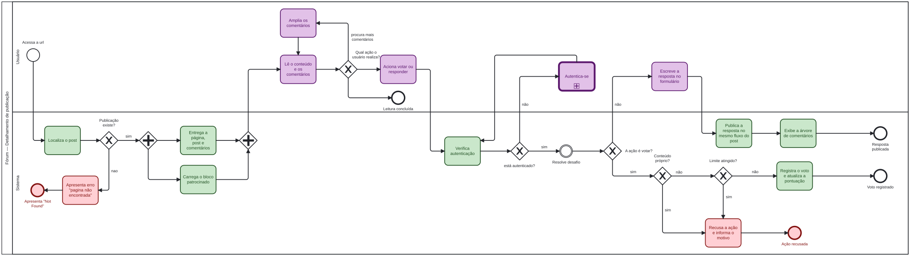

# Modelagem BPMN — Detalhamento de Publicação

---

## 1. Contexto

Este artefato modela, em notação BPMN, o processo de detalhamento de uma publicação: desde o acesso do usuário à URL do post até o desfecho de cada ação possível sobre o conteúdo. Ele é o segundo produto do Foco 2 da Subequipe_03 e deriva diretamente da Engenharia Reversa documentada no artefato anterior, que analisou o TabNews como sistema de referência.

A relação entre os dois artefatos é de dependência, não de justaposição. Cada atividade, gateway e evento do modelo tem origem em uma regra de negócio identificada na Engenharia Reversa, e essa correspondência está registrada na seção 5.

## 2. Justificativa da notação e do subconjunto adotado e BPMN

A BPMN é mantida pela Object Management Group e é hoje o padrão de fato para modelagem de processos de negócio. Sua vantagem para este projeto é específica: a notação distingue explicitamente os participantes do processo por meio de piscinas e raias, o que permite representar de forma inequívoca o que é responsabilidade do usuário e o que é responsabilidade do sistema. Essa distinção é justamente o achado central da Engenharia Reversa, que identificou ações executadas inteiramente no cliente, sem qualquer troca com o servidor.

A notação completa, porém, é extensa. Zur Muehlen e Recker (2008) examinaram o uso real da BPMN em uma amostra ampla de modelos e constataram que os praticantes empregam apenas uma pequena parcela do vocabulário disponível: um núcleo reduzido de elementos aparece na quase totalidade dos diagramas, enquanto a maior parte da notação é raramente ou nunca utilizada. Os autores concluem que a adoção de um subconjunto não empobrece o modelo, e que ampliar o vocabulário sem necessidade tende a reduzir a compreensibilidade em vez de aumentá-la.

Esta modelagem adota deliberadamente esse núcleo. Os elementos utilizados são:

| Elemento | Uso neste modelo |
|---|---|
| Piscina e raias | Separação entre Usuário e Sistema |
| Evento de início | Acesso à URL da publicação |
| Atividades | Ações concretas de cada participante |
| Gateway exclusivo | Pontos de decisão de caminho único |
| Gateway paralelo | Carregamentos simultâneos na abertura |
| Evento intermediário | Desafio de verificação disparado durante as ações |
| Call Activity | Fluxo de autenticação, de responsabilidade de outra subequipe |
| Eventos de fim | Desfechos normais e de erro |
| Anotações de texto | Registro de estados que não constituem atividade |

Elementos como gateways complexos, sub-processos de compensação e eventos de escalonamento não foram empregados por não corresponderem a nenhum comportamento observado no sistema de referência.

**Convenção de nomenclatura.** Atividades são nomeadas com verbo na terceira pessoa do singular seguido do objeto, conforme a orientação da disciplina: "Verifica autenticação", não "Verificação de autenticação". Gateways são nomeados como pergunta fechada, e cada fluxo de saída recebe o rótulo da resposta correspondente.

## 3. Escopo do processo

**Início.** O usuário acessa a URL de uma publicação.

**Fim.** O processo se encerra em um dos cinco desfechos: leitura concluída, voto registrado, resposta publicada, ação recusada por regra de negócio, ou publicação não encontrada.

**Fora do escopo.** O fluxo de autenticação em si é representado como Call Activity, por pertencer a outra subequipe. Também ficam de fora a criação de publicação a partir do zero, a moderação de conteúdo e a edição de comentário já publicado.

## 4. Descrição do fluxo

### 4.1 Abertura da página

O processo inicia quando o usuário acessa a URL da publicação. O sistema localiza a publicação e um gateway exclusivo decide o caminho:

- **Publicação não encontrada:** o sistema apresenta a página de conteúdo não encontrado e o processo termina em evento de fim de erro.
- **Publicação encontrada:** um gateway paralelo abre dois caminhos simultâneos. Em um deles o sistema entrega a página com o post e a árvore de comentários já montada; no outro, carrega o bloco de conteúdo patrocinado. Os dois convergem em um gateway paralelo de junção, e o usuário passa a ler o conteúdo.

O paralelismo se restringe a esses dois ramos. A entrega do post, dos comentários e da pontuação é **uma única atividade**, porque o sistema de referência produz tudo em uma única consulta e serve a página já pronta.

### 4.2 Leitura e ações disponíveis

Após a leitura, um gateway exclusivo distribui o fluxo conforme a ação do usuário:

- **Amplia a exibição de comentários:** atividade executada inteiramente na raia do Usuário, sem qualquer fluxo para a raia do Sistema, retornando à leitura. Esse é o ponto do modelo que mais depende da Engenharia Reversa: a expansão de respostas não gera requisição ao servidor, porque a árvore completa já chegou na abertura.
- **Aciona votar** ou **aciona responder:** ambos seguem para a verificação de autenticação.
- **Encerra a leitura:** evento de fim normal.

### 4.3 Verificação de autenticação

As duas ações de interação convergem para a atividade "Verifica autenticação", na raia do Sistema, seguida de gateway exclusivo:

- **Não autenticado:** o fluxo segue para a Call Activity de autenticação, na raia do Usuário, e retorna ao ponto de verificação.
- **Autenticado:** o fluxo prossegue para o caminho específico da ação.

Esse gateway está posicionado **depois** do acionamento da ação, e não antes da entrega da página nem da exibição dos controles. A razão é um achado da Engenharia Reversa: como a página é servida já pronta e igual para todos, os controles de interação são exibidos a qualquer visitante, e a exigência de sessão só se manifesta no clique.

Imediatamente após a autenticação, e ainda no caminho das ações, encontra-se o evento intermediário "Resolve desafio de verificação de origem". Ele não é evento de início: no sistema de referência o desafio é reativo, disparado quando o servidor sinaliza necessidade durante uma operação de escrita, e não na abertura da página.

### 4.4 Caminho de votar

O voto atravessa dois gateways exclusivos adicionais, em sequência:

1. **O conteúdo é do próprio usuário?** Em caso afirmativo, o sistema recusa a ação e informa o motivo, encerrando em evento de fim de erro.
2. **O limite de votos foi atingido?** Em caso afirmativo, o mesmo desfecho de recusa.

Superadas as duas condições, o sistema registra o voto, atualiza a pontuação exibida e o processo termina em evento de fim normal.

### 4.5 Caminho de responder

Autenticado o usuário, ele escreve a resposta. O sistema então publica a resposta e a exibe na árvore de comentários, encerrando em evento de fim normal.

O modelo não duplica o fluxo para "responder ao post" e "responder a um comentário". A Engenharia Reversa mostrou que ambas são a mesma operação no sistema de referência, distinguidas apenas pela presença de uma referência ao conteúdo pai. A distinção fica registrada como anotação de texto sobre a atividade de publicação, não como ramificação.

### 4.6 Anotações

Duas informações relevantes não constituem atividade e aparecem como anotações de texto:

- Sobre a atividade de entrega da página: um comentário excluído no meio da discussão é substituído por um marcador, e a estrutura da thread é preservada.
- Sobre a atividade de publicar resposta: post e comentário são a mesma entidade, diferenciados pela referência ao conteúdo pai.

## 5. Rastreabilidade

Cada elemento do modelo remete a uma regra de negócio da Engenharia Reversa.

| Elemento do modelo | Regra de origem |
|---|---|
| Localiza a publicação / gateway "Publicação existe?" | RN16 |
| Entrega a página com post e comentários | RN01, RN09 |
| Carrega o bloco patrocinado (ramo paralelo) | RN15 |
| Lê o conteúdo e os comentários | RN03 |
| Amplia a exibição de comentários (sem fluxo para o Sistema) | RN11, RN12 |
| Controles disponíveis antes da verificação | RN04, RN05 |
| Verifica autenticação / gateway "Está autenticado?" | RN06 |
| Resolve desafio de verificação de origem (evento intermediário) | RN14 |
| Gateway "O conteúdo é do próprio usuário?" | RN07 |
| Gateway "O limite de votos foi atingido?" | RN08 |
| Registra o voto | RN09 |
| Publica a resposta | RN02 |
| Anotação sobre comentário excluído | RN17 |
| Recusa a ação e informa o motivo | RNF06 |

## 6. Considerações

O modelo cobre o caminho principal e cinco desfechos distintos, incluindo três de erro, o que só foi possível porque a Engenharia Reversa incluiu uma etapa deliberada de provocação de exceções. Sem ela, o diagrama teria se restringido ao caminho feliz.

Duas decisões de modelagem merecem registro por serem contraintuitivas e por decorrerem de evidência, não de suposição. A primeira é a ausência de paralelismo na entrega do conteúdo, contrária ao que a estrutura de endpoints do sistema de referência sugeria. A segunda é a posição tardia do gateway de autenticação, que não bloqueia a leitura nem a exibição dos controles.

O processo modelado descreve o comportamento pretendido para o Fórum, informado pelo sistema de referência. Não é uma descrição do TabNews, e sim a especificação de um fluxo próprio que adota as soluções consideradas adequadas e incorpora, em RNF03, uma melhoria em relação ao que foi observado.

## Referências

OMG. **Business Process Model and Notation (BPMN)**, Version 2.0. Object Management Group, 2011.

ZUR MUEHLEN, M.; RECKER, J. How Much Language Is Enough? Theoretical and Practical Use of the Business Process Modeling Notation. In: **Advanced Information Systems Engineering (CAiSE 2008)**, Lecture Notes in Computer Science, v. 5074. Berlim: Springer, 2008. p. 465-479.

SUBEQUIPE_03. **Engenharia Reversa — Página de Detalhamento de Post**. Projeto G2 — Fórum, Arquitetura & Desenho de Software, UnB/FGA, 2026.